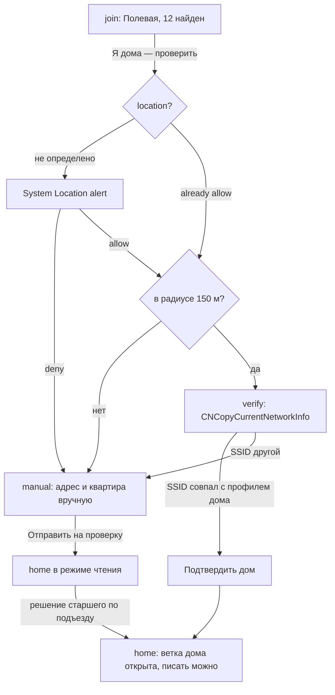
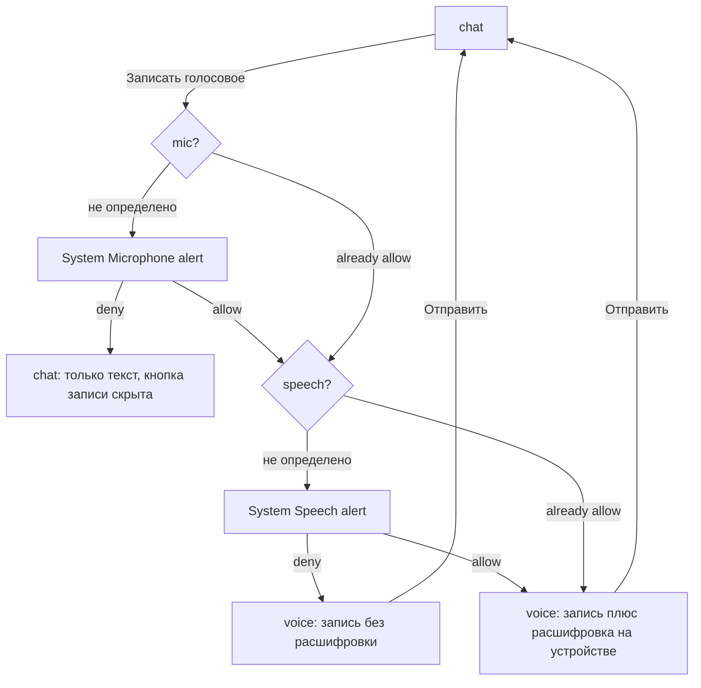
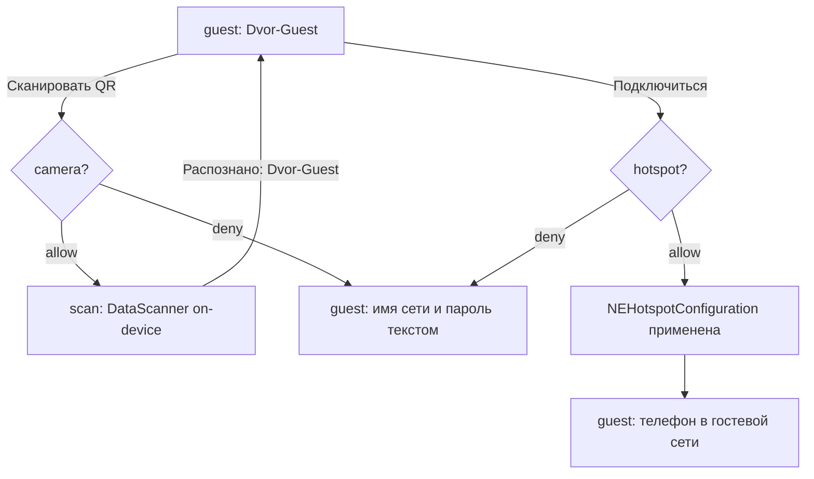
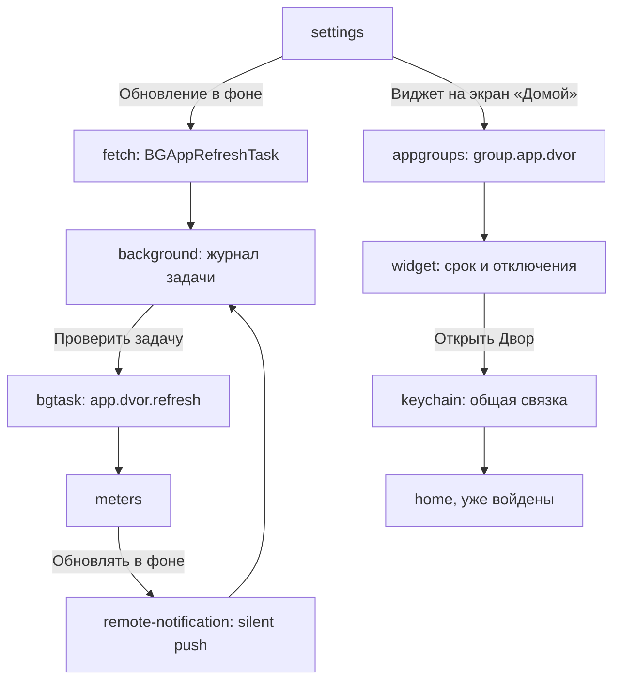

# Двор — карта экранов и архитектура

Числа, которые должны совпадать во всех разделах: **20 заявленных ключей · 31 экран · 4 вкладки дока · 8 прототипов**.

Блоки `@generated:*` пересобираются командой `npm run docs -- dvor` из `concept.json` и разметки экранов — внутрь них руками не пишем.

---

## Информационная архитектура

### Док из четырёх разделов

Холодный старт открывает **регистрацию по почте**: `phone` → `join`. OTP и подтверждения адреса нет. Дока и permission-алертов на регистрации нет: доступы начинаются после создания аккаунта и после того, как дом подтверждён.

### Стек навигации

Дерево ниже выведено из разметки экранов и `concept.json`, руками не правится: вложенность — по `parent`, подпись «открывается» — реальный элемент прототипа.

<!-- @generated:ia-tree -->
```
Вход по номеру (phone) — старт, без таб-бара · открывается: старт
    ├─ Пароль (password) — push, без таб-бара · открывается: «Далее», «Изменить пароль»
    │   └─ Аккаунт (account) — push, без таб-бара · открывается: «Профиль и аккаунт»
    │       └─ Удаление аккаунта (deleteaccount) — push, без таб-бара · открывается: «Удалить аккаунт»
    ├─ Создать аккаунт (register) — push, без таб-бара · открывается: «Создать аккаунт»
    │   └─ Пароль нового аккаунта (registerpassword) — push, без таб-бара · открывается: «Далее»
    └─ Найдите свой дом (join) — push · открывается: «Продолжить без аккаунта», «Войти» … · location
        ├─ Проверка сети (verify) — modal · открывается: «Я дома — проверить» (location), «Проверить домашнюю сеть заново» · wifiinfo
        └─ Адрес вручную (manual) — push · открывается: «Я дома — проверить» (location), «Моего дома нет в списке»

Дом (home) — tab (root) · открывается: «Подтвердить дом» (wifiinfo), «Добавить дом», «Открыть Двор из виджета» (keychain) · photos
    ├─ Объявление (post) — push · открывается: «Что нового в доме», «Объявление: отключение горячей воды» … · push
    ├─ Сообщить о проблеме (problem) — sheet · открывается: «Сообщить о проблеме», «Оформить заявку по этой проблеме» …, «Снять кадр» · camera
    │   └─ Камера (shoot) — системная поверхность · открывается: «Фото с места» (camera)
    └─ Хроника двора (chronicle) — push · открывается: «Собрать хронику двора» (photos), «Открыть хронику двора», «Хроника двора»

Двор (yard) — tab (root) · открывается: «Схема двора» · voip
    ├─ Гостевая сеть (guest) — push · открывается: «Гостевая сеть двора», «Гостевая сеть», «Распознано: Dvor-Guest» · hotspot
    │   └─ Сканер QR (scan) — системная поверхность · открывается: «Сканировать QR с лавочки»
    └─ Счётчики (meters) — push · открывается: «Счётчики», «Проверить фоновую задачу» (bgtask) · remotenotif
        └─ Обновление в фоне (background) — системная поверхность · открывается: «Обновлять показания и срок в фоне» (remotenotif), «Обновление в фоне» (fetch) · bgtask

События дома (events) — tab (root) · открывается: «События дома», «События подъездов» … · calendar, mic, speech, commnotif

Меню (menu) — tab (root) · открывается: «Открыть настройки», «Продолжить» (tracking), «Разблокировать Двор по Face ID» · contacts
    ├─ Пароли дома (passwords) — push · открывается: «Пароли дома» · autofill
    │   └─ Автозаполнение в Safari (fill) — системная поверхность · открывается: «Включить автозаполнение паролей дома» (autofill)
    ├─ Соседи из контактов (neighbors) — push · открывается: «Соседи из контактов» (contacts)
    ├─ Профиль соседа (profile) — push · открывается: «Мой профиль жильца», «Профиль Петра Ильина, кв. 12» …
    └─ Настройки (settings) — push · открывается: «Настройки» · fetch, appgroups, faceid
        ├─ Реклама (ads) — modal · открывается: «Реклама местных услуг», «Реклама и отслеживание» · tracking
        ├─ Замок Face ID (lock) — системная поверхность · открывается: «Замок Face ID на приложении» (faceid)
        └─ Виджет на экране «Домой» (widget) — системная поверхность · открывается: «Виджет на экран «Домой»» (appgroups) · keychain
```
<!-- @end -->

### Модалки и sheets

`verify` — модалка, а не push: это не раздел, а результат проверки, и закрывается он либо подтверждением дома, либо возвратом на `join`.

### Правила IA

---

## Системные поверхности как отдельные экраны

Шесть поверхностей внутри своего приложения плюс седьмая — панель автозаполнения в чужом Safari. Все они нарисованы отдельными экранами не для красоты: **на своих экранах приложения результат entitlement'а не видно.** Ревьюер, который не увидел результат, читает entitlement как заявленный «про запас» — это 5.1.1 и 2.5.4.

### `shoot` — камера

`AVFoundation`, полноэкранный тёмный вид с подсказкой «снимите так, чтобы было видно дверь и доводчик». Зачем отдельным экраном: `NSCameraUsageDescription` защищается не текстом строки, а тем, что съёмка действительно ведёт к результату — тост «Кадр добавлен к заявке» возвращает в `problem`, где кадр приложен к заявке 4417-Б. Открывается с `problem`, отказ оставляет `problem` с фото из медиатеки.

### `scan` — сканер QR

`DataScannerViewController`, распознавание на устройстве. Второй триггер того же ключа камеры и отдельный экран, потому что сценарий другой: наводка на QR-код с лавочки у второго подъезда, результат «Распознано: Dvor-Guest» и возврат в `guest` с уже заполненными параметрами сети. Без этого экрана `hotspot` выглядел бы как настройка сети из ниоткуда.

### `lockscreen` — уведомление с аватаром

### `background` — журнал фоновой задачи

Доказательство сразу трёх ключей: `UIBackgroundModes: fetch`, `UIBackgroundModes: remote-notification` и `BGTaskSchedulerPermittedIdentifiers`. Экран показывает идентификатор `app.dvor.refresh`, режим `fetch + remote-notification`, время последнего запуска и журнал строками:

```
04:12  BGAppRefreshTask запущен системой
04:12  объявления дома: +2
04:13  срок показаний пересчитан: 25 апреля
04:13  снапшот виджета перезаписан
09:41  silent push: содержимое темы 4417-Б
```

Журнал нужен потому, что фоновый режим по определению не наблюдаем в момент проверки: ревьюер не может дождаться, пока система запустит задачу. Кнопка «Проверить задачу» уводит на `meters`, где обе обновлённые строки — срок и показания — видны сразу.

### `lock` — замок Face ID

`LocalAuthentication`, политика `deviceOwnerAuthentication`. Отдельный экран, потому что `NSFaceIDUsageDescription` защищается ответом на вопрос «что именно вы прячете»: на экране написано — адрес, номера квартир и коды от общих дверей. Там же сказано, что распознавание делает система, приложение получает только «да» или «нет». Запасной путь — «Ввести код-пароль», он на том же экране.

### `widget` — виджет на экране «Домой»

Доказательство `com.apple.security.application-groups` и `keychain-access-groups` одновременно. На экране домашний экран iOS с виджетом «Двор · Полевая, 12», внутри — отключение горячей воды и срок показаний, ниже подписи: контейнер `group.app.dvor`, сессия — Keychain общей группы. Кнопка «Открыть Двор» активирует `keychain` и открывает `home` **уже войденным** — это и есть проверяемый результат общей связки ключей. Без обеих групп виджет был бы пустым, а вход пришлось бы повторять в каждом расширении.

### `fill` — панель автозаполнения в Safari

Доказательство `com.apple.developer.authentication-services.autofill-credential-provider`, и единственная поверхность **вне** приложения: страница `uk-polevaya.ru`, поле «Личный кабинет», подсказка над клавиатурой «Двор · 12-74» и вариант «Другой пароль». Подпись объясняет разделение ответственности: подсказку выдаёт расширение «Двора», пароль остаётся в связке ключей, в поле его подставляет система. Экран светлый, в отличие от остальных поверхностей, — потому что Safari светлый; тёмная версия читалась бы как свой UI, а это чужой.

---

## Карта экранов

<!-- @generated:screen-map -->
| ID | Название | Тип | Доступы |
|---|---|---|---|
| `phone` | Вход по номеру | старт, без таб-бара | — |
| `password` | Пароль | push, без таб-бара | — |
| `register` | Создать аккаунт | push, без таб-бара | — |
| `registerpassword` | Пароль нового аккаунта | push, без таб-бара | — |
| `account` | Аккаунт | push, без таб-бара | — |
| `deleteaccount` | Удаление аккаунта | push, без таб-бара | — |
| `join` | Найдите свой дом | push | location |
| `verify` | Проверка сети | modal | wifiinfo (activate) |
| `manual` | Адрес вручную | push | — |
| `home` | Дом | tab (root) | photos |
| `post` | Объявление | push | push |
| `problem` | Сообщить о проблеме | sheet | camera |
| `shoot` | Камера | системная поверхность | — |
| `chronicle` | Хроника двора | push | — |
| `yard` | Двор | tab (root) | voip (activate) |
| `guest` | Гостевая сеть | push | hotspot |
| `scan` | Сканер QR | системная поверхность | — |
| `meters` | Счётчики | push | remotenotif (activate) |
| `background` | Обновление в фоне | системная поверхность | bgtask (activate) |
| `events` | События дома | tab (root) | calendar, mic, speech, commnotif (activate) |
| `menu` | Меню | tab (root) | contacts |
| `passwords` | Пароли дома | push | autofill (activate) |
| `fill` | Автозаполнение в Safari | системная поверхность | — |
| `neighbors` | Соседи из контактов | push | — |
| `profile` | Профиль соседа | push | — |
| `settings` | Настройки | push | fetch (activate), appgroups (activate), faceid |
| `ads` | Реклама | modal | tracking |
| `lock` | Замок Face ID | системная поверхность | — |
| `widget` | Виджет на экране «Домой» | системная поверхность | keychain (activate) |
<!-- @end -->

Колонка «Доступы» показывает экран, **с которого ключ запрашивается**, а не все экраны, где результат виден. Пометка `(activate)` — entitlement без системного алерта.

---

## Переходы: откуда куда и чем

Каждая строка — элемент, который есть в прототипе. Вкладки дока опущены: они ведут в корни разделов и одинаковы на всех экранах.

## Действия на экранах

Каждый интерактивный элемент прототипа: что он делает, куда ведёт и какой ключ при этом запрашивается. В отличие от таблицы переходов выше, вкладки таб-бара, кнопки возврата и подтверждения без перехода тоже здесь — раздел выводится из разметки и отвечает на вопрос «что делает эта кнопка», не заставляя открывать HTML.

Три строки в таблице читаются неочевидно: у них нет парной строки «отказ → fallback», потому что разрешение и отказ приводят на один и тот же экран.

- `post` → `post` по «Следить за темой»: подписка включилась либо тема помечена точкой в ленте — результат виден здесь же, уводить некуда.
- `guest` → `guest` по «Подключиться к Dvor-Guest»: подключение меняет состояние карточки сети, а не экран; при неудаче на её месте оказывается имя сети с паролем текстом.
- `events` → `events` по «Добавить субботник в Календарь»: событие либо ушло в системный календарь, либо осталось внутри «Двора» с напоминанием в приложении — обе версии это одна и та же карточка события.

Ещё одна строка объясняется отдельно: `lock` → `menu` по «Разблокировать Двор по Face ID». Замок снимается не в тот раздел, откуда его включили, а в «Меню» — потому что в реальном приложении экран замка встречает при запуске, а не открывается из настроек. Запасной путь «Ввести код-пароль» ведёт назад в `settings`.

---

## Матрица доступов

Двадцать ключей набора: чем заслужен, каким жестом вызывается, что остаётся при отказе.

<!-- @generated:perm-matrix -->
| Ключ | Жест пользователя | Экран | Если отказ | Риск Review |
|---|---|---|---|---|
| `NSLocationWhenInUseUsageDescription` | «Я дома — проверить» | Найдите свой дом | Остаётся подтверждение адреса вручную — заявку смотрит старший по подъезду | **Условный** — CLLocationManager whenInUse: без него iOS не отдаёт имя текущей сети |
| `com.apple.developer.networking.wifi-info` | «Проверить сеть» | Проверка сети | Без entitlement подтверждение остаётся только ручным — не ship | **Условный** — CNCopyCurrentNetworkInfo плюс выданная геопозиция — иначе SSID приходит пустым |
| `NSCameraUsageDescription` | «Снять» и «Сканировать QR» | Сообщить о проблеме | Остаётся фото из медиатеки и ввод имени сети с паролем руками | Низкий |
| `NSPhotoLibraryUsageDescription` | «Собрать хронику» | Дом | В хронике остаются только кадры, снятые в приложении | Низкий |
| `aps-environment` | «Следить за темой» | Объявление | Ответы видны при открытии, тема помечается точкой в ленте | **Условный** — регистрация в APNs через Firebase Cloud Messaging и отправка из консоли — своего сервера нет |
| `UIBackgroundModes: remote-notification` | «Обновлять в фоне» | Счётчики | Без режима цифры обновляются только при открытии | **Условный** — обработчик didReceiveRemoteNotification, который переписывает снапшот виджета |
| `UIBackgroundModes: fetch` | «Обновление в фоне» | Настройки | Без режима лента и срок обновляются в момент открытия | **Условный** — BGAppRefreshTask, который реально читает объявления своего дома из Firestore |
| `BGTaskSchedulerPermittedIdentifiers` | «Проверить задачу» | Обновление в фоне | Незарегистрированный идентификатор — задача не запустится вообще | **Условный** — строка в Info.plist совпадает с BGTaskScheduler.register — иначе падение при регистрации |
| `com.apple.security.application-groups` | «Виджет на экран „Домой“» | Настройки | Без группы виджет пустой, а пересланное объявление не доходит — не ship | Низкий |
| `keychain-access-groups` | «Открыть Двор» из виджета | Виджет на экране «Домой» | Без общей группы вход придётся повторять в каждом расширении | Низкий |
| `com.apple.developer.authentication-services.autofill-credential-provider` | «Включить автозаполнение» | Пароли дома | Пароль остаётся копировать руками из карточки | Низкий |
| `com.apple.developer.networking.HotspotConfiguration` | «Подключиться» | Гостевая сеть | Имя сети и пароль показываются текстом — вводится руками в Настройках | Низкий |
| `NSContactsUsageDescription` | «Найти среди контактов» | Меню | Остаётся поиск по номеру квартиры и по подъезду | Средний |
| `NSCalendarsFullAccessUsageDescription` | «Добавить в Календарь» | События дома | Событие остаётся только внутри «Двора», с напоминанием в приложении | Низкий |
| `NSFaceIDUsageDescription` | «Замок Face ID» | Настройки | Остаётся код-пароль устройства | Низкий |
| `NSUserTrackingUsageDescription` | «Продолжить» | Реклама | Реклама остаётся, но неперсонализированная — не по интересам | **Условный** — рекламный SDK в сборке, IDFA действительно уходит в SDK — иначе промпт нечем оправдать |
| `NSMicrophoneUsageDescription` | «Новая заявка голосом» | События дома | Заявку можно заполнить текстом | Низкий |
| `NSSpeechRecognitionUsageDescription` | «Новая заявка голосом» — после микрофона | События дома | Черновик можно заполнить с клавиатуры | Низкий |
| `com.apple.developer.usernotifications.communication` | «Доводчик, второй подъезд» | События дома | Без entitlement статус заявки приходит обычным уведомлением | **Условный** — INSendMessageIntent только для ответа ответственного по заявке |
| `UIBackgroundModes: voip` | «Домофон» | Двор | Без режима вызова останется обычное уведомление с кадром посетителя | **Условный** — PushKit + CallKit и реальный WebRTC-сеанс только с панелью дома |
<!-- @end -->

### Три ключа набора не заявлены

Решение принято человеком и записано здесь, а не выведено из спеки: 19 из 22 — сознательный результат, а не недоделка.

---

## Восемь условных доступов

Условный доступ — тот, который держится не на формулировке usage-string, а на том, что реально оказалось в сборке. Для каждого назван требуемый минимум: если его нет, ключ пустой, и это дыра, а не мелочь.

**Отдельно про связку геопозиции и Wi-Fi.** Порядок здесь не косметический: `CNCopyCurrentNetworkInfo` вернёт пустое имя сети, пока не выдано разрешение на геопозицию. Поэтому геопозиция спрашивается на `join` — раньше, чем сеть, — и на самом экране написано, зачем: «Геопозиция нужна ещё и затем, чтобы iOS отдала имя сети». Если этого не объяснить, запрос читается как лишний, а связка двух ключей — как трекинг.

**Отдельно про два фоновых режима на одну задачу.** `fetch` и `remote-notification` заявлены вместе, но обслуживают одну задачу `app.dvor.refresh` и обновляют один и тот же снапшот. Разница в поводе: `fetch` — по расписанию системы к утру, `remote-notification` — по тихому пушу, когда в теме появилось новое. Третьего фонового режима в сборке нет.

**Правило, которое важнее матрицы:** до каждой фичи ревьюер должен дойти сам за два-три тапа без инструкции. Фича, которая в сборке есть, но спрятана, по последствиям равна её отсутствию.

---

## Privacy strings

Девять ключей набора требуют usage-string. Остальные десять — entitlement'ы и фоновые режимы, у них системного текста нет; их защищают Review notes и экраны-доказательства.

Строка про календарь заявлена как full access осознанно: `NSCalendarsWriteOnlyAccessUsageDescription` не позволяет найти собственное событие, чтобы поправить его при переносе собрания, а переносы здесь — норма. Для iOS ниже 17 в Info.plist остаётся `NSCalendarsUsageDescription`.

Строка про медиатеку тоже заявлена шире PHPicker осознанно: приложение само обходит библиотеку и отбирает кадры по геометке. PHPicker решал бы другую задачу — «выбери из того, что помнишь», а здесь как раз житель и не помнит, какие снимки здешние.

---

## User flows

### Пропуск в ветку дома — два ключа подряд



`wifiinfo` здесь — entitlement, системного алерта нет: экран `verify` показывает результат чтения, а не запрос. Ручной путь не тупик: ветка дома открыта на чтение сразу, писать можно после решения старшего по подъезду.



Отказ в микрофоне не спрашивает распознавание: второй ключ без первого бессмысленен. Отказ только в распознавании оставляет голосовое рабочим — теряется текст рядом, а не сообщение.

### Гостевая сеть — камера, потом Hotspot



Два ключа на одном экране, и оба имеют собственное состояние отказа: `data-show-denied="camera"`, `data-show-denied="hotspot"` и общий блок `camera,hotspot` для случая, когда отказано в обоих.

### Фон, виджет и общая сессия



Все пять ключей на этой схеме — entitlement'ы: ни одного системного алерта, поэтому каждый заканчивается экраном, где виден результат.

---

## Архитектура клиента

### Слои

`PermissionsService` — единственная точка запроса доступов. Экраны спрашивают у него статус и подписываются на изменения; `AVCaptureDevice.requestAccess`, `CNContactStore.requestAccess` и подобное из UI не вызывается.

### Расширения в сборке

| Расширение | Зачем | Ключи |
|---|---|---|
| Widget Extension | Виджет со сроком показаний и отключениями | `appgroups`, `keychain` |
| Notification Service Extension | Подстановка аватара соседа в уведомление | `commnotif`, `appgroups` |
| Credential Provider Extension | Подсказка над клавиатурой в Safari | `autofill`, `keychain` |

Три расширения читают один контейнер и одну связку ключей — отсюда обе группы в entitlements, и отсюда же необходимость экранов `widget` и `fill`.

### Что лежит на устройстве

| Данные | Где | Уходит наружу |
|---|---|---|
| Показания счётчиков и срок передачи | CoreData | Нет. В УК — вручную, через системный share sheet |
| Хроника двора и результат обхода медиатеки | CoreData, ссылки на `PHAsset` | Только те кадры, которые житель отметил сам |
| Черновики заявок и кадры до отправки | CoreData + FileManager | Только по кнопке «Отправить» |
| Имя домашней сети из профиля дома | CoreData | Нет. SSID не отправляется и не логируется |
| Совпадения адресной книги со списком дома | Память до выхода с экрана | Нет. Книга не покидает устройство |
| Токен сессии | Keychain общей группы | Нет |
| Пароли общих сервисов дома | Keychain общей группы | Нет. Публикует записи старший по дому |
| Снапшот виджета | `group.app.dvor`, JSON | Нет |
| Координаты точки дома | Профиль дома в CoreData | Нет. Трек перемещений не ведётся вообще |

---

## Заметки для Review

## Граница «без бэкенда»

<!-- @generated:backendless -->
| Требовало бы сервера | Решение без сервера |
|---|---|
| Опциональные вход и регистрация по номеру телефона | SDK провайдера аутентификации, пароль и токен сессии в Keychain |
| Ветки домов, профили жильцов, соцграф | Firestore со security rules: ветка дома пишется только теми, чей дом подтверждён. Правила — конфигурация, не серверный код |
| Подтверждение «я правда здесь живу» | Клиент: геопозиция в радиусе двора плюс `CNCopyCurrentNetworkInfo` против SSID, записанного в профиле дома. Модерация не нужна |
| Уведомления о темах и сообщениях | Firebase Cloud Messaging, рассылка из консоли провайдера; аватар подставляет Notification Service Extension |
| Объявления управляющей компании | Публикует старший по дому в том же Firestore, роль — флаг в документе дома. Парсера сайтов УК нет |
| Схема двора и адреса | MapKit и `MKLocalSearch`; поэтажный план и разметка двора рисуются кодом как данные |
| Показания счётчиков и срок передачи | CoreData на устройстве, срок считается локально по дате; отправка в УК — системный share sheet |
| Поиск знакомых среди жильцов | Локальная сверка `CNContactStore` со списком дома, уже загруженным на устройство |
| Пароли общих сервисов дома | Keychain общей группы плюс Credential Provider extension; публикует записи старший по дому |
| Хроника двора из фотографий | `PHAsset` с фильтром по геометке и дате — обход библиотеки идёт на устройстве |
| Монетизация без подписки | Рекламный SDK, ставки и креативы на стороне сети; ATT после экрана-объяснения |
<!-- @end -->
