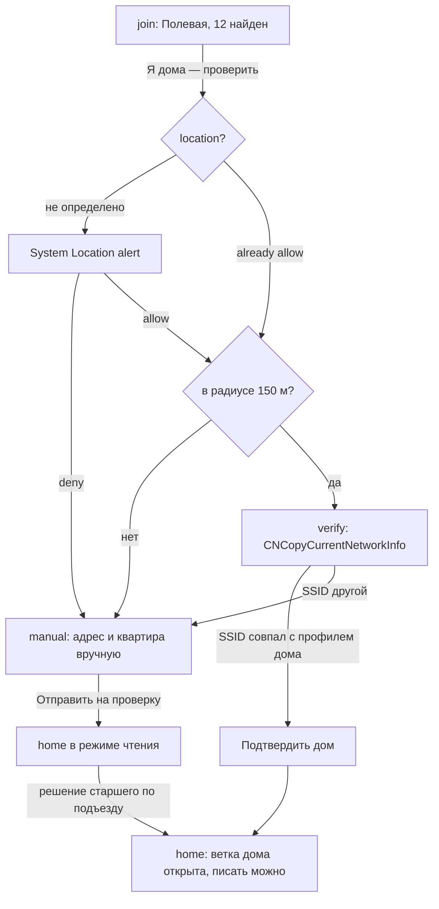
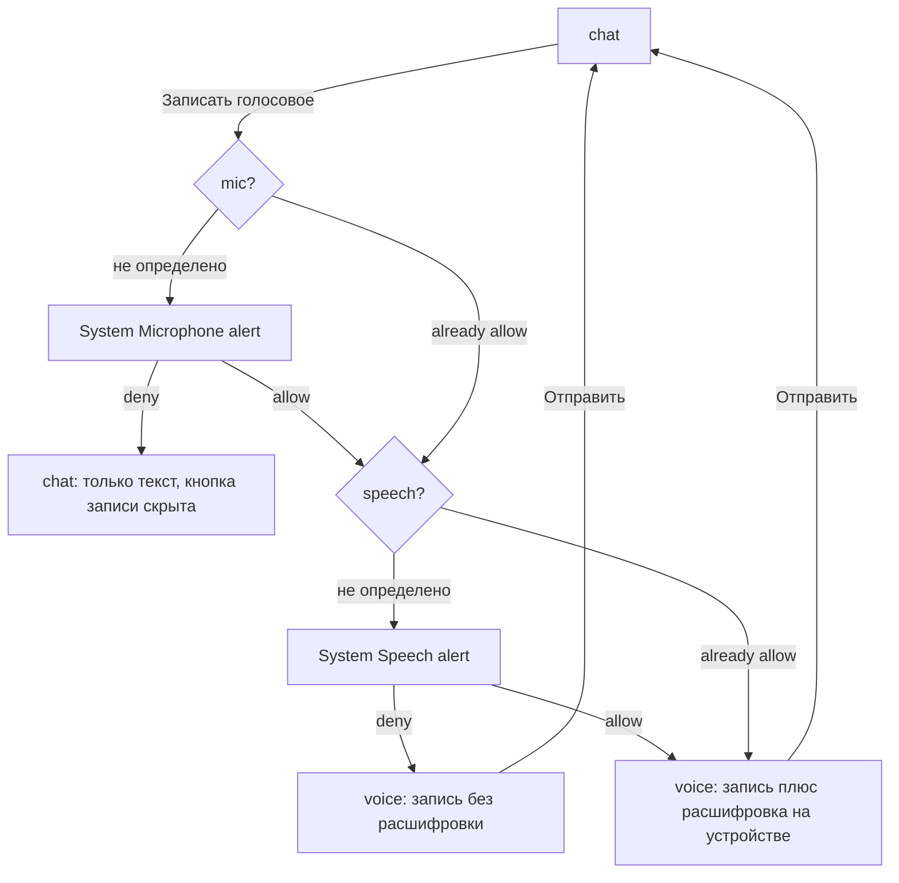
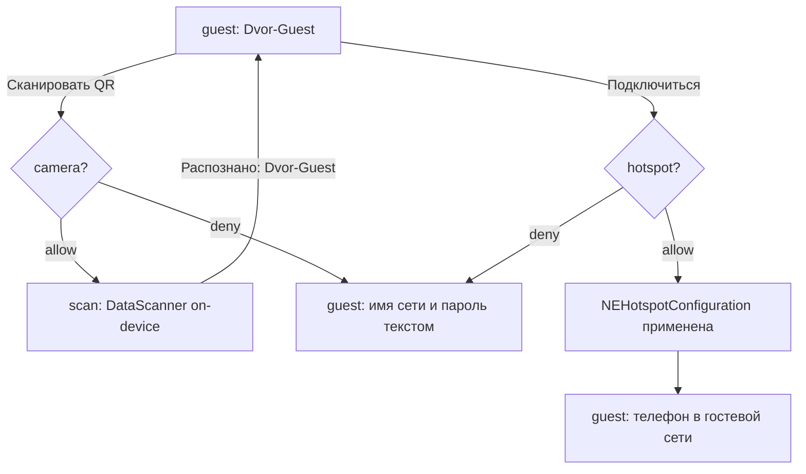
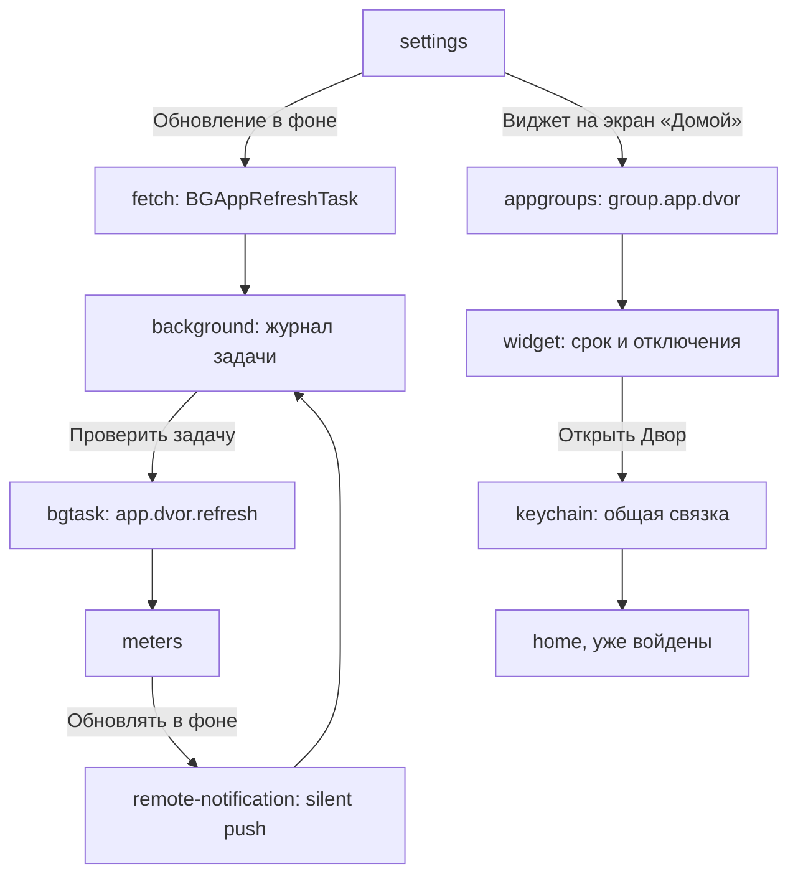

# Двор — карта экранов и архитектура

Документ согласован с [01-product-vision.md](./01-product-vision.md). Приложение клиентское: серверного кода не пишется, общая база и чат закрыты SDK провайдера с security rules. Все доступы — just-in-time, после входа по номеру. Background Modes — только `fetch` и `remote-notification`, оба под одну фоновую задачу `app.dvor.refresh`.

Числа, которые должны совпадать во всех разделах: **20 заявленных ключей · 31 экран · 4 вкладки дока · 8 прототипов**.

Блоки `@generated:*` пересобираются командой `npm run docs -- dvor` из `concept.json` и разметки экранов — внутрь них руками не пишем.

---

## Информационная архитектура

### Док из четырёх разделов

Холодный старт открывает **вход по номеру**: `phone` → `code` → `join`. Дока и permission-алертов на этих экранах нет: доступы начинаются после входа и после того, как дом подтверждён.

| Раздел | Root screen ID | Роль |
|---|---|---|
| Дом | `home` | Лента своего дома: объявления УК, заявки, хроника двора |
| Чаты | `chats` | Чаты дома и подъездов, голосовые с расшифровкой |
| Двор | `yard` | Схема двора и корпусов, гостевая сеть, счётчики, события |
| Меню | `menu` | Профиль, соседи, пароли дома, настройки и доступы |

Разделение сделано по типу объекта, а не по частоте: «Дом» — про то, что произошло, «Двор» — про инфраструктуру, «Чаты» — про людей, «Меню» — про себя и служебное. Счётчики и события лежат в «Дворе», а не в «Меню», потому что это инфраструктура дома, а не настройка пользователя; из «Меню» на них есть быстрые плитки.

### Стек навигации

Дерево ниже выведено из разметки экранов и `concept.json`, руками не правится: вложенность — по `parent`, подпись «открывается» — реальный элемент прототипа.

<!-- @generated:ia-tree -->
```
Вход по почте или Google (phone) — старт, без таб-бара · открывается: старт
    └─ Код из письма (code) — push · открывается: «Продолжить с почтой»
        ├─ Неверный код (codefail) — push · открывается: «2»
        └─ Найдите свой дом (join) — push · открывается: «G», «Продолжить» · location
            ├─ Проверка сети (verify) — modal · открывается: «Я дома — проверить» (location), «Проверить домашнюю сеть заново» · wifiinfo
            └─ Адрес вручную (manual) — push · открывается: «Я дома — проверить» (location), «Моего дома нет в списке»

Дом (home) — tab (root) · открывается: «Подтвердить дом» (wifiinfo), «Добавить дом», «Открыть Двор из виджета» (keychain) · photos
    ├─ Объявление (post) — push · открывается: «Что нового в доме», «Объявление: отключение горячей воды» … · push
    ├─ Сообщить о проблеме (problem) — sheet · открывается: «Сообщить о проблеме», «Оформить заявку по этой проблеме» …, «Снять кадр» · camera
    │   └─ Камера (shoot) — системная поверхность · открывается: «Фото с места» (camera)
    └─ Хроника двора (chronicle) — push · открывается: «Собрать хронику двора» (photos), «Открыть хронику двора», «Хроника двора»

Чаты (chats) — tab (root) · открывается: «Чаты подъездов»
    └─ Чат подъезда (chat) — push · открывается: «Чат третьего подъезда, Полевая 12», «Чат всего дома» …, «Отправить голосовое», «Открыть чат подъезда» · mic, speech, commnotif
        ├─ Голосовое (voice) — sheet · открывается: «Записать голосовое» (mic + speech)
        └─ Экран блокировки (lockscreen) — системная поверхность · открывается: «Показывать как сообщение» (commnotif)

Двор (yard) — tab (root) · открывается: «Схема двора»
    ├─ Гостевая сеть (guest) — push · открывается: «Гостевая сеть двора», «Гостевая сеть», «Распознано: Dvor-Guest» · hotspot
    │   └─ Сканер QR (scan) — системная поверхность · открывается: «Сканировать QR с лавочки» (camera)
    ├─ Счётчики (meters) — push · открывается: «Счётчики», «Проверить фоновую задачу» (bgtask) · remotenotif
    │   └─ Обновление в фоне (background) — системная поверхность · открывается: «Обновлять показания и срок в фоне» (remotenotif), «Обновление в фоне» (fetch) · bgtask
    └─ События дома (events) — push · открывается: «События дома» · calendar

Меню (menu) — tab (root) · открывается: «Продолжить» (tracking), «Разблокировать Двор по Face ID» · contacts
    ├─ Пароли дома (passwords) — push · открывается: «Пароли дома» · autofill
    │   └─ Автозаполнение в Safari (fill) — системная поверхность · открывается: «Включить автозаполнение паролей дома» (autofill)
    ├─ Соседи из контактов (neighbors) — push · открывается: «Соседи из контактов» (contacts)
    ├─ Профиль соседа (profile) — push · открывается: «Кто в подъезде», «Мой профиль жильца» …, «Завершить вызов» · voip
    │   └─ Звонок в квартиру (call) — системная поверхность · открывается: «Позвонить в квартиру 12» (voip)
    └─ Настройки (settings) — push · открывается: «Настройки» · fetch, appgroups, faceid
        ├─ Реклама (ads) — modal · открывается: «Реклама местных услуг», «Реклама и отслеживание» · tracking
        ├─ Замок Face ID (lock) — системная поверхность · открывается: «Замок Face ID на приложении» (faceid)
        └─ Виджет на экране «Домой» (widget) — системная поверхность · открывается: «Виджет на экран «Домой»» (appgroups) · keychain
```
<!-- @end -->

### Модалки и sheets

| Экран | Представление | Откуда |
|---|---|---|
| `verify` | modal поверх `join` | «Я дома — проверить», геопозиция разрешена; повторно — «Настройки → Проверить сеть заново» |
| `problem` | sheet поверх `home` | лента дома, схема двора |
| `voice` | sheet поверх `chat` | чат подъезда, после цепочки микрофон + распознавание |
| `ads` | modal (объяснение, затем ATT) | «Настройки → Реклама и отслеживание», плитка «Реклама» в «Меню» |

`verify` — модалка, а не push: это не раздел, а результат проверки, и закрывается он либо подтверждением дома, либо возвратом на `join`.

### Правила IA

1. Первые экраны — всегда **вход по номеру** (`phone` → `code`), **без** permission-алертов. Ни один доступ не спрашивается до того, как житель попал на `join`.
2. Один capability = один явный жест. Исключение — entitlement'ы: `wifiinfo`, `commnotif`, `remotenotif`, `fetch`, `bgtask`, `appgroups`, `keychain`, `autofill` активируются сценарием и системного alert не показывают. В прототипе это `data-activate`, а не `data-ask`.
3. Отказ → рабочий fallback, а не заглушка, и он лежит **на том экране, куда отказ привёл**. Отказ в геопозиции с `join` уводит на `manual` — значит объяснение «автопроверка недоступна, заявку смотрит старший по подъезду» написано на `manual`, а не на `join`.
4. Fallback ещё и **убирает** то, чего без доступа быть не может: без геопозиции со схемы двора исчезают точка «вы здесь» и расстояния до подъездов, сама схема остаётся — она привязана к адресу из профиля дома. Без контактов исчезает блок совпадений, без камеры на «Гостевой сети» — кнопка скана, и остаётся имя сети с паролем текстом.
5. Повторный системный alert не показываем никогда. Второй раз — только «Открыть Настройки».
6. Цепочка `mic + speech` в чате подъезда: два алерта подряд. Отказ на первом шаге уводит на fallback и второй ключ уже не спрашивается — голосовое остаётся недоступным, текстовое поле на месте.
7. Отказ, который оставляет переключатель выключенным, — тоже fallback. У `push` и `tracking` есть и то и другое: блок с объяснением на `post` и на `ads` плюс свитч в «Настройках», который остаётся выключенным. У `faceid` объясняющего блока нет сознательно — выключенный свитч «Замок Face ID» и подпись «в приложении адрес, номера квартир и коды» говорят всё, а второй текст рядом дублировал бы состояние.
8. Сбой фичи ≠ отказ доступа. Камера разрешена, но QR не распознался — это состояние экрана `scan`, а не состояние доступа; путь наружу — ввод имени сети и пароля руками.
9. Успех подтверждается тостом, а не экраном: `data-toast="Текст|экран"` — полоска и переход туда, где результат виден. «Кадр добавлен к заявке» ведёт обратно в `problem`, «Голосовое отправлено · 0:11 с расшифровкой» — в `chat`.
10. Родитель каждого экрана объявлен в `concept.json` (`parent`), по нему считается возврат. Экраны с несколькими входами (`problem`, `meters`, `guest`, `ads`) возвращаются туда, откуда их реально открыли.
11. Ветка дома закрыта наружу: экрана «другие дома» нет ни одного, и попасть в чужой дом из интерфейса невозможно в принципе.

---

## Системные поверхности как отдельные экраны

Шесть поверхностей внутри своего приложения плюс седьмая — панель автозаполнения в чужом Safari. Все они нарисованы отдельными экранами не для красоты: **на своих экранах приложения результат entitlement'а не видно.** Ревьюер, который не увидел результат, читает entitlement как заявленный «про запас» — это 5.1.1 и 2.5.4.

### `shoot` — камера

`AVFoundation`, полноэкранный тёмный вид с подсказкой «снимите так, чтобы было видно дверь и доводчик». Зачем отдельным экраном: `NSCameraUsageDescription` защищается не текстом строки, а тем, что съёмка действительно ведёт к результату — тост «Кадр добавлен к заявке» возвращает в `problem`, где кадр приложен к заявке 4417-Б. Открывается с `problem`, отказ оставляет `problem` с фото из медиатеки.

### `scan` — сканер QR

`DataScannerViewController`, распознавание на устройстве. Второй триггер того же ключа камеры и отдельный экран, потому что сценарий другой: наводка на QR-код с лавочки у второго подъезда, результат «Распознано: Dvor-Guest» и возврат в `guest` с уже заполненными параметрами сети. Без этого экрана `hotspot` выглядел бы как настройка сети из ниоткуда.

### `lockscreen` — уведомление с аватаром

Единственное место, где видно разницу, которую даёт `com.apple.developer.usernotifications.communication`. Экран показывает две карточки подряд: сверху — уведомление как сообщение, с аватаром соседа и подписью «Пётр, кв. 12», ниже — то же уведомление без entitlement'а, где имя ушло в текст, аватара нет и в сводку Focus оно не попадает. Это доказательство entitlement'а в одном кадре: `INSendMessageIntent` донатится, Notification Service Extension подставляет аватар из общего контейнера.

### `background` — журнал фоновой задачи

Доказательство сразу трёх ключей: `UIBackgroundModes: fetch`, `UIBackgroundModes: remote-notification` и `BGTaskSchedulerPermittedIdentifiers`. Экран показывает идентификатор `app.dvor.refresh`, режим `fetch + remote-notification`, время последнего запуска и журнал строками:

```
04:12  BGAppRefreshTask запущен системой
04:12  объявления дома: +2
04:13  срок показаний пересчитан: 25 апреля
04:13  снапшот виджета перезаписан
09:41  silent push: содержимое темы 4417-Б
```

Журнал нужен потому, что фоновый режим по определению не наблюдаем в момент проверки: ревьюер не может дождаться, пока система запустит задачу. Кнопка «Проверить задачу» уводит на `meters`, где обе обновлённые строки — срок и показания — видны сразу.

### `lock` — замок Face ID

`LocalAuthentication`, политика `deviceOwnerAuthentication`. Отдельный экран, потому что `NSFaceIDUsageDescription` защищается ответом на вопрос «что именно вы прячете»: на экране написано — адрес, номера квартир и коды от общих дверей. Там же сказано, что распознавание делает система, приложение получает только «да» или «нет». Запасной путь — «Ввести код-пароль», он на том же экране.

### `widget` — виджет на экране «Домой»

Доказательство `com.apple.security.application-groups` и `keychain-access-groups` одновременно. На экране домашний экран iOS с виджетом «Двор · Полевая, 12», внутри — отключение горячей воды и срок показаний, ниже подписи: контейнер `group.app.dvor`, сессия — Keychain общей группы. Кнопка «Открыть Двор» активирует `keychain` и открывает `home` **уже войденным** — это и есть проверяемый результат общей связки ключей. Без обеих групп виджет был бы пустым, а вход пришлось бы повторять в каждом расширении.

### `fill` — панель автозаполнения в Safari

Доказательство `com.apple.developer.authentication-services.autofill-credential-provider`, и единственная поверхность **вне** приложения: страница `uk-polevaya.ru`, поле «Личный кабинет», подсказка над клавиатурой «Двор · 12-74» и вариант «Другой пароль». Подпись объясняет разделение ответственности: подсказку выдаёт расширение «Двора», пароль остаётся в связке ключей, в поле его подставляет система. Экран светлый, в отличие от остальных поверхностей, — потому что Safari светлый; тёмная версия читалась бы как свой UI, а это чужой.

---

## Карта экранов

<!-- @generated:screen-map -->
| ID | Название | Тип | Доступы |
|---|---|---|---|
| `phone` | Вход по почте или Google | старт, без таб-бара | — |
| `code` | Код из письма | push | — |
| `codefail` | Неверный код | push | — |
| `join` | Найдите свой дом | push | location |
| `verify` | Проверка сети | modal | wifiinfo (activate) |
| `manual` | Адрес вручную | push | — |
| `home` | Дом | tab (root) | photos |
| `post` | Объявление | push | push |
| `problem` | Сообщить о проблеме | sheet | camera |
| `shoot` | Камера | системная поверхность | — |
| `chronicle` | Хроника двора | push | — |
| `chats` | Чаты | tab (root) | — |
| `chat` | Чат подъезда | push | mic, speech, commnotif (activate) |
| `voice` | Голосовое | sheet | — |
| `lockscreen` | Экран блокировки | системная поверхность | — |
| `yard` | Двор | tab (root) | — |
| `guest` | Гостевая сеть | push | hotspot |
| `scan` | Сканер QR | системная поверхность | — |
| `meters` | Счётчики | push | remotenotif (activate) |
| `background` | Обновление в фоне | системная поверхность | bgtask (activate) |
| `events` | События дома | push | calendar |
| `menu` | Меню | tab (root) | contacts |
| `passwords` | Пароли дома | push | autofill (activate) |
| `fill` | Автозаполнение в Safari | системная поверхность | — |
| `neighbors` | Соседи из контактов | push | — |
| `profile` | Профиль соседа | push | voip (activate) |
| `call` | Звонок в квартиру | системная поверхность | — |
| `settings` | Настройки | push | fetch (activate), appgroups (activate), faceid |
| `ads` | Реклама | modal | tracking |
| `lock` | Замок Face ID | системная поверхность | — |
| `widget` | Виджет на экране «Домой» | системная поверхность | keychain (activate) |
<!-- @end -->

Колонка «Доступы» показывает экран, **с которого ключ запрашивается**, а не все экраны, где результат виден. Пометка `(activate)` — entitlement без системного алерта.

---

## Переходы: откуда куда и чем

Каждая строка — элемент, который есть в прототипе. Вкладки дока опущены: они ведут в корни разделов и одинаковы на всех экранах.

<!-- @generated:transitions -->
| Экран | Что можно сделать | Ведёт на | Доступ | Тип перехода |
|---|---|---|---|---|
| `phone` | «Продолжить с почтой» | `code` | — | переход |
| `phone` | «G» | `join` | — | переход |
| `code` | «Назад к номеру» | `phone` | — | возврат по IA |
| `code` | «2» | `codefail` | — | переход |
| `code` | «Продолжить» | `join` | — | переход |
| `codefail` | «Назад к коду» | `code` | — | возврат по IA |
| `join` | «Я дома — проверить» | `verify` | `NSLocationWhenInUseUsageDescription` | доступ разрешён |
| `join` | «Я дома — проверить» | `manual` | `NSLocationWhenInUseUsageDescription` | отказ → fallback |
| `join` | «Моего дома нет в списке» | `manual` | — | переход |
| `verify` | «Назад к выбору дома» | `join` | — | возврат по IA |
| `verify` | «Подтвердить дом» | `home` | `com.apple.developer.networking.wifi-info` | entitlement, без alert |
| `manual` | «Назад к выбору дома» | `join` | — | возврат по IA |
| `manual` | «Добавить дом» | `home` | — | переход |
| `home` | «Сообщить о проблеме», «Оформить заявку по этой проблеме» | `problem` | — | переход |
| `home` | «Что нового в доме», «Объявление: отключение горячей воды» … | `post` | — | переход |
| `home` | «Собрать хронику двора» | `chronicle` | `NSPhotoLibraryUsageDescription` | доступ разрешён |
| `home` | «Собрать хронику двора» | `home` | `NSPhotoLibraryUsageDescription` | отказ → fallback |
| `home` | «Открыть хронику двора» | `chronicle` | — | переход |
| `post` | «Назад в ленту дома» | `home` | — | возврат по IA |
| `post` | «Следить за темой» | `post` | `aps-environment` | доступ разрешён |
| `problem` | «Закрыть заявку» | `home` | — | возврат по IA |
| `problem` | «Фото с места» | `shoot` | `NSCameraUsageDescription` | доступ разрешён |
| `problem` | «Фото с места» | `problem` | `NSCameraUsageDescription` | отказ → fallback |
| `shoot` | «Закрыть камеру» | `problem` | — | возврат по IA |
| `shoot` | «Снять кадр» | `problem` | — | подтверждение |
| `chronicle` | «Назад в ленту дома» | `home` | — | возврат по IA |
| `chats` | «Чат третьего подъезда, Полевая 12», «Чат всего дома» | `chat` | — | переход |
| `chat` | «Назад к чатам» | `chats` | — | возврат по IA |
| `chat` | «Кто в подъезде» | `profile` | — | переход |
| `chat` | «Показывать как сообщение» | `lockscreen` | `com.apple.developer.usernotifications.communication` | entitlement, без alert |
| `chat` | «Записать голосовое» | `voice` | `NSMicrophoneUsageDescription + NSSpeechRecognitionUsageDescription` | доступ разрешён |
| `chat` | «Записать голосовое» | `chat` | `NSMicrophoneUsageDescription + NSSpeechRecognitionUsageDescription` | отказ → fallback |
| `voice` | «Закрыть запись», «Свернуть» … | `chat` | — | возврат по IA |
| `voice` | «Отправить голосовое» | `chat` | — | подтверждение |
| `lockscreen` | «Открыть чат подъезда» | `chat` | — | переход |
| `yard` | «Сообщить о проблеме во дворе» | `problem` | — | переход |
| `yard` | «Гостевая сеть двора» | `guest` | — | переход |
| `yard` | «Счётчики» | `meters` | — | переход |
| `yard` | «События дома» | `events` | — | переход |
| `guest` | «Назад во двор» | `yard` | — | возврат по IA |
| `guest` | «Сканировать QR с лавочки» | `scan` | `NSCameraUsageDescription` | доступ разрешён |
| `guest` | «Сканировать QR с лавочки» | `guest` | `NSCameraUsageDescription` | отказ → fallback |
| `guest` | «Подключиться к Dvor-Guest» | `guest` | `com.apple.developer.networking.HotspotConfiguration` | доступ разрешён |
| `scan` | «Закрыть сканер» | `guest` | — | возврат по IA |
| `scan` | «Распознано: Dvor-Guest» | `guest` | — | подтверждение |
| `meters` | «Назад к двору» | `yard` | — | возврат по IA |
| `meters` | «Обновлять показания и срок в фоне» | `background` | `UIBackgroundModes: remote-notification` | entitlement, без alert |
| `background` | «Назад к счётчикам» | `meters` | — | возврат по IA |
| `background` | «Проверить фоновую задачу» | `meters` | `BGTaskSchedulerPermittedIdentifiers` | entitlement, без alert |
| `events` | «Назад к двору» | `yard` | — | возврат по IA |
| `events` | «Добавить субботник в Календарь» | `events` | `NSCalendarsFullAccessUsageDescription` | доступ разрешён |
| `menu` | «Настройки» | `settings` | — | переход |
| `menu` | «Мой профиль жильца» | `profile` | — | переход |
| `menu` | «Соседи из контактов» | `neighbors` | `NSContactsUsageDescription` | доступ разрешён |
| `menu` | «Счётчики» | `meters` | — | переход |
| `menu` | «События дома» | `events` | — | переход |
| `menu` | «Пароли дома» | `passwords` | — | переход |
| `menu` | «Гостевая сеть» | `guest` | — | переход |
| `menu` | «Хроника двора» | `chronicle` | — | переход |
| `menu` | «Чаты подъездов» | `chats` | — | переход |
| `menu` | «Реклама местных услуг» | `ads` | — | переход |
| `menu` | «Схема двора» | `yard` | — | переход |
| `passwords` | «Назад в меню» | `menu` | — | возврат по IA |
| `passwords` | «Включить автозаполнение паролей дома» | `fill` | `com.apple.developer.authentication-services.autofill-credential-provider` | entitlement, без alert |
| `fill` | «Вернуться в приложение «Двор»» | `passwords` | — | возврат по IA |
| `neighbors` | «Назад в меню» | `menu` | — | возврат по IA |
| `neighbors` | «Профиль Петра Ильина, кв. 12», «Профиль Марины Кольцовой, кв. 48» … | `profile` | — | переход |
| `profile` | «Назад в меню» | `menu` | — | возврат по IA |
| `profile` | «Написать Петру в чат подъезда» | `chat` | — | переход |
| `profile` | «Позвонить в квартиру 12» | `call` | `UIBackgroundModes: voip` | entitlement, без alert |
| `call` | «Завершить вызов» | `profile` | — | подтверждение |
| `settings` | «Назад в меню» | `menu` | — | возврат по IA |
| `settings` | «Проверить домашнюю сеть заново» | `verify` | — | переход |
| `settings` | «Обновление в фоне» | `background` | `UIBackgroundModes: fetch` | entitlement, без alert |
| `settings` | «Виджет на экран «Домой»» | `widget` | `com.apple.security.application-groups` | entitlement, без alert |
| `settings` | «Замок Face ID на приложении» | `lock` | `NSFaceIDUsageDescription` | доступ разрешён |
| `settings` | «Замок Face ID на приложении» | `settings` | `NSFaceIDUsageDescription` | отказ → fallback |
| `settings` | «Реклама и отслеживание» | `ads` | — | переход |
| `ads` | «Закрыть экран про рекламу» | `settings` | — | возврат по IA |
| `ads` | «Продолжить» | `menu` | `NSUserTrackingUsageDescription` | доступ разрешён |
| `ads` | «Продолжить» | `ads` | `NSUserTrackingUsageDescription` | отказ → fallback |
| `lock` | «Разблокировать Двор по Face ID» | `menu` | — | переход |
| `lock` | «Ввести код-пароль вместо Face ID» | `settings` | — | возврат по IA |
| `widget` | «Открыть Двор из виджета» | `home` | `keychain-access-groups` | entitlement, без alert |
<!-- @end -->

Три строки в таблице читаются неочевидно: у них нет парной строки «отказ → fallback», потому что разрешение и отказ приводят на один и тот же экран.

- `post` → `post` по «Следить за темой»: подписка включилась либо тема помечена точкой в ленте — результат виден здесь же, уводить некуда.
- `guest` → `guest` по «Подключиться к Dvor-Guest»: подключение меняет состояние карточки сети, а не экран; при неудаче на её месте оказывается имя сети с паролем текстом.
- `events` → `events` по «Добавить субботник в Календарь»: событие либо ушло в системный календарь, либо осталось внутри «Двора» с напоминанием в приложении — обе версии это одна и та же карточка события.

Ещё одна строка объясняется отдельно: `lock` → `menu` по «Разблокировать Двор по Face ID». Замок снимается не в тот раздел, откуда его включили, а в «Меню» — потому что в реальном приложении экран замка встречает при запуске, а не открывается из настроек. Запасной путь «Ввести код-пароль» ведёт назад в `settings`.

---

## Матрица доступов

Двадцать ключей набора: чем заслужен, каким жестом вызывается, что остаётся при отказе.

<!-- @generated:perm-matrix -->
| Ключ | Жест пользователя | Экран | Если отказ | Риск Review |
|---|---|---|---|---|
| `NSLocationWhenInUseUsageDescription` | «Я дома — проверить» | Найдите свой дом | Остаётся подтверждение адреса вручную — заявку смотрит старший по подъезду | **Условный** — CLLocationManager whenInUse: без него iOS не отдаёт имя текущей сети |
| `com.apple.developer.networking.wifi-info` | «Проверить сеть» | Проверка сети | Без entitlement подтверждение остаётся только ручным — не ship | **Условный** — CNCopyCurrentNetworkInfo плюс выданная геопозиция — иначе SSID приходит пустым |
| `NSCameraUsageDescription` | «Снять» и «Сканировать QR» | Сообщить о проблеме | Остаётся фото из медиатеки и ввод имени сети с паролем руками | Низкий |
| `NSPhotoLibraryUsageDescription` | «Собрать хронику» | Дом | В хронике остаются только кадры, снятые в приложении | Низкий |
| `NSMicrophoneUsageDescription` | «Записать голосовое» | Чат подъезда | Остаётся текстовое сообщение | Низкий |
| `NSSpeechRecognitionUsageDescription` | «Записать голосовое» — цепочкой с микрофоном | Чат подъезда | Голосовое отправляется без расшифровки | Низкий |
| `aps-environment` | «Следить за темой» | Объявление | Ответы видны при открытии, тема помечается точкой в ленте | **Условный** — регистрация в APNs через Firebase Cloud Messaging и отправка из консоли — своего сервера нет |
| `com.apple.developer.usernotifications.communication` | «Показывать как сообщение» | Чат подъезда | Без entitlement уведомление обычное: имя в тексте, без аватара и вне сводки | **Условный** — донат INSendMessageIntent и Notification Service Extension, подставляющий аватар |
| `UIBackgroundModes: remote-notification` | «Обновлять в фоне» | Счётчики | Без режима цифры обновляются только при открытии | **Условный** — обработчик didReceiveRemoteNotification, который переписывает снапшот виджета |
| `UIBackgroundModes: fetch` | «Обновление в фоне» | Настройки | Без режима лента и срок обновляются в момент открытия | **Условный** — BGAppRefreshTask, который реально читает объявления своего дома из Firestore |
| `BGTaskSchedulerPermittedIdentifiers` | «Проверить задачу» | Обновление в фоне | Незарегистрированный идентификатор — задача не запустится вообще | **Условный** — строка в Info.plist совпадает с BGTaskScheduler.register — иначе падение при регистрации |
| `com.apple.security.application-groups` | «Виджет на экран „Домой“» | Настройки | Без группы виджет пустой, а пересланное объявление не доходит — не ship | Низкий |
| `keychain-access-groups` | «Открыть Двор» из виджета | Виджет на экране «Домой» | Без общей группы вход придётся повторять в каждом расширении | Низкий |
| `com.apple.developer.authentication-services.autofill-credential-provider` | «Включить автозаполнение» | Пароли дома | Пароль остаётся копировать руками из карточки | Низкий |
| `UIBackgroundModes: voip` | «Позвонить» | Профиль соседа | Без режима вызов приходит обычным уведомлением, и на него надо успеть открыть приложение | **Условный** — PushKit плюс CallKit и реальный звонок: без CallKit режим не защитить на review |
| `com.apple.developer.networking.HotspotConfiguration` | «Подключиться» | Гостевая сеть | Имя сети и пароль показываются текстом — вводится руками в Настройках | Низкий |
| `NSContactsUsageDescription` | «Найти среди контактов» | Меню | Остаётся поиск по номеру квартиры и по подъезду | Средний |
| `NSCalendarsFullAccessUsageDescription` | «Добавить в Календарь» | События дома | Событие остаётся только внутри «Двора», с напоминанием в приложении | Низкий |
| `NSFaceIDUsageDescription` | «Замок Face ID» | Настройки | Остаётся код-пароль устройства | Низкий |
| `NSUserTrackingUsageDescription` | «Продолжить» | Реклама | Реклама остаётся, но неперсонализированная — не по интересам | **Условный** — рекламный SDK в сборке, IDFA действительно уходит в SDK — иначе промпт нечем оправдать |
<!-- @end -->

### Три ключа набора не заявлены

| Ключ | Почему не заявлен |
|---|---|
| `com.apple.developer.associated-domains` | Диплинков в концептах не делаем вообще: ни Universal Links, ни приёма чужих ссылок, ни превью по Open Graph. Фичи под ключ в сборке нет, а ключ без достижимой фичи заявлять нельзя |
| `UIBackgroundModes: voip` | Честный сценарий требует реальных звонков на CallKit. Высокий риск 2.5.4 оправдан только ядровой фичей; у соседской сети звонок ядровой фичей не является |
| `UIBackgroundModes: audio` | Тот же случай: без реального playback и заполненного Now Playing режим не защищается. Голосовые в чате играются на переднем плане |

Решение принято человеком и записано здесь, а не выведено из спеки: 19 из 22 — сознательный результат, а не недоделка.

---

## Восемь условных доступов

Условный доступ — тот, который держится не на формулировке usage-string, а на том, что реально оказалось в сборке. Для каждого назван требуемый минимум: если его нет, ключ пустой, и это дыра, а не мелочь.

| Ключ | Требуемый минимум в сборке | Что проверяемо руками |
|---|---|---|
| `NSLocationWhenInUseUsageDescription` | `CLLocationManager` в режиме whenInUse — без него iOS не отдаёт имя текущей сети | На `verify` показано расстояние до точки дома (38 м) и радиус двора (150 м); на схеме двора — своя точка |
| `com.apple.developer.networking.wifi-info` | `CNCopyCurrentNetworkInfo` плюс уже выданная геопозиция — иначе SSID приходит пустым | На `verify` рядом лежат «Сеть: Polevaya-12» и «В профиле дома: Polevaya-12» со отметкой «Совпало» |
| `aps-environment` | Настоящая регистрация в APNs через Firebase Cloud Messaging и хотя бы один живой пуш из консоли — своего сервера нет | Подписка по «Следить за темой» на `post`; пуш приходит, когда УК ответила |
| `com.apple.developer.usernotifications.communication` | Донат `INSendMessageIntent` и Notification Service Extension, подставляющий аватар | Экран `lockscreen`: две карточки — с entitlement'ом и без |
| `UIBackgroundModes: remote-notification` | Обработчик `didReceiveRemoteNotification`, который переписывает снапшот виджета | Строка `09:41 silent push` в журнале `background`, обновлённая цифра в виджете |
| `UIBackgroundModes: fetch` | `BGAppRefreshTask`, который реально читает объявления своего дома из Firestore | Две строки — объявления и срок показаний — видны на `meters` и в виджете сразу после запуска |
| `BGTaskSchedulerPermittedIdentifiers` | Строка в Info.plist совпадает с `BGTaskScheduler.register` до символа — иначе падение при регистрации | Идентификатор `app.dvor.refresh` написан на экране `background` и совпадает с журналом |
| `NSUserTrackingUsageDescription` | Рекламный SDK в сборке, IDFA действительно уходит в SDK — иначе промпт нечем оправдать | Экран `ads` объясняет обмен до промпта; отказ оставляет неперсонализированную рекламу |

**Отдельно про связку геопозиции и Wi-Fi.** Порядок здесь не косметический: `CNCopyCurrentNetworkInfo` вернёт пустое имя сети, пока не выдано разрешение на геопозицию. Поэтому геопозиция спрашивается на `join` — раньше, чем сеть, — и на самом экране написано, зачем: «Геопозиция нужна ещё и затем, чтобы iOS отдала имя сети». Если этого не объяснить, запрос читается как лишний, а связка двух ключей — как трекинг.

**Отдельно про два фоновых режима на одну задачу.** `fetch` и `remote-notification` заявлены вместе, но обслуживают одну задачу `app.dvor.refresh` и обновляют один и тот же снапшот. Разница в поводе: `fetch` — по расписанию системы к утру, `remote-notification` — по тихому пушу, когда в теме появилось новое. Третьего фонового режима в сборке нет.

**Правило, которое важнее матрицы:** до каждой фичи ревьюер должен дойти сам за два-три тапа без инструкции. Фича, которая в сборке есть, но спрятана, по последствиям равна её отсутствию.

---

## Privacy strings

Девять ключей набора требуют usage-string. Остальные десять — entitlement'ы и фоновые режимы, у них системного текста нет; их защищают Review notes и экраны-доказательства.

| Ключ | Смысл строки (RU → EN для стора) |
|---|---|
| Location When In Use | Проверка, что вы в границах своего двора / Checking you are inside your yard |
| Camera | Съёмка проблем во дворе и сканирование QR гостевой сети / Photographing yard issues and scanning the guest network QR |
| Photo Library | Поиск ваших снимков, сделанных в границах двора / Finding your photos taken inside the yard |
| Microphone | Голосовые сообщения в чат подъезда / Voice messages in the entrance chat |
| Speech Recognition | Расшифровка голосового рядом с сообщением / Transcribing voice messages next to the message |
| Contacts | Кто из ваших знакомых уже живёт в этом доме / Which of your contacts already live in this building |
| Calendars Full Access | События дома в календаре, с правкой при переносе даты / Building events in your calendar, editable when rescheduled |
| Face ID | Замок на приложении: адрес, номера квартир и коды дверей / Locking the app: address, apartment numbers, door codes |
| User Tracking | Реклама местных услуг по интересам / Interest-based ads for local services |

Строка про календарь заявлена как full access осознанно: `NSCalendarsWriteOnlyAccessUsageDescription` не позволяет найти собственное событие, чтобы поправить его при переносе собрания, а переносы здесь — норма. Для iOS ниже 17 в Info.plist остаётся `NSCalendarsUsageDescription`.

Строка про медиатеку тоже заявлена шире PHPicker осознанно: приложение само обходит библиотеку и отбирает кадры по геометке. PHPicker решал бы другую задачу — «выбери из того, что помнишь», а здесь как раз житель и не помнит, какие снимки здешние.

---

## User flows

### Пропуск в ветку дома — два ключа подряд



`wifiinfo` здесь — entitlement, системного алерта нет: экран `verify` показывает результат чтения, а не запрос. Ручной путь не тупик: ветка дома открыта на чтение сразу, писать можно после решения старшего по подъезду.

### Голосовое в чат подъезда — цепочка из двух алертов



Отказ в микрофоне не спрашивает распознавание: второй ключ без первого бессмысленен. Отказ только в распознавании оставляет голосовое рабочим — теряется текст рядом, а не сообщение.

### Гостевая сеть — камера, потом Hotspot



Два ключа на одном экране, и оба имеют собственное состояние отказа: `data-show-denied="camera"`, `data-show-denied="hotspot"` и общий блок `camera,hotspot` для случая, когда отказано в обоих.

### Фон, виджет и общая сессия



Все пять ключей на этой схеме — entitlement'ы: ни одного системного алерта, поэтому каждый заканчивается экраном, где виден результат.

---

## Архитектура клиента

### Слои

| Слой | Содержимое |
|---|---|
| **UI** | 31 экран, док из четырёх разделов, nav stack, system ask, снекбар, семь системных поверхностей. Статусы доступов не хранит — только отображает |
| **Domain** | `House` · `Resident` · `HouseVerification` · `Thread` · `Post` · `Issue` · `Chat` · `Message` · `VoiceNote` · `Meter` · `MeterReading` · `HouseEvent` · `GuestNetwork` · `HousePassword` · `ChronicleItem` · `AdConsent` |
| **Services** | `Permissions` · `HouseVerification` (CLLocationManager + CNCopyCurrentNetworkInfo) · `Capture` (AVFoundation) · `QRScanner` (DataScanner) · `MediaLibrary` (PHAsset + PHPicker) · `VoiceRecorder` (AVAudioRecorder) · `Transcriber` (SFSpeechRecognizer, on-device) · `Push` (FCM) · `NotificationService` (INSendMessageIntent + NSE) · `BackgroundRefresh` (BGTaskScheduler, `app.dvor.refresh`) · `HotspotSetup` (NEHotspotConfigurationManager) · `ContactsMatch` (CNContactStore) · `Calendar` (EventKit) · `AppLock` (LocalAuthentication) · `CredentialProvider` (ASCredentialProviderViewController) · `WidgetSnapshot` · `PhoneAuth` (SDK провайдера) · `AdsAttribution` (ATT) |
| **Data** | CoreData — показания, хроника, черновики заявок, список жильцов своего дома. Keychain общей группы — токен сессии и записи паролей дома. Контейнер `group.app.dvor` — снапшот виджета в JSON и аватары для NSE. FileManager — кадры и аудио до отправки |
| **External** | SDK входа по номеру (VK ID / Firebase Phone Auth) · Firestore — ветки домов, профили, чат · Firebase Storage — аудио голосовых · Firebase Cloud Messaging — пуши и тихие пуши · MapKit и `MKLocalSearch` — адреса и схема двора · рекламный SDK |

`PermissionsService` — единственная точка запроса доступов. Экраны спрашивают у него статус и подписываются на изменения; `AVCaptureDevice.requestAccess`, `CNContactStore.requestAccess` и подобное из UI не вызывается.

### Расширения в сборке

| Расширение | Зачем | Ключи |
|---|---|---|
| Widget Extension | Виджет со сроком показаний и отключениями | `appgroups`, `keychain` |
| Notification Service Extension | Подстановка аватара соседа в уведомление | `commnotif`, `appgroups` |
| Credential Provider Extension | Подсказка над клавиатурой в Safari | `autofill`, `keychain` |

Три расширения читают один контейнер и одну связку ключей — отсюда обе группы в entitlements, и отсюда же необходимость экранов `widget` и `fill`.

### Что лежит на устройстве

| Данные | Где | Уходит наружу |
|---|---|---|
| Показания счётчиков и срок передачи | CoreData | Нет. В УК — вручную, через системный share sheet |
| Хроника двора и результат обхода медиатеки | CoreData, ссылки на `PHAsset` | Только те кадры, которые житель отметил сам |
| Черновики заявок и кадры до отправки | CoreData + FileManager | Только по кнопке «Отправить» |
| Имя домашней сети из профиля дома | CoreData | Нет. SSID не отправляется и не логируется |
| Совпадения адресной книги со списком дома | Память до выхода с экрана | Нет. Книга не покидает устройство |
| Токен сессии | Keychain общей группы | Нет |
| Пароли общих сервисов дома | Keychain общей группы | Нет. Публикует записи старший по дому |
| Снапшот виджета | `group.app.dvor`, JSON | Нет |
| Координаты точки дома | Профиль дома в CoreData | Нет. Трек перемещений не ведётся вообще |

Единственные данные, которые пишутся в общую базу: тексты в ветке дома и чате, аудио голосовых, отметка «дом подтверждён» и профиль жильца. Ни геопозиции, ни SSID, ни адресной книги, ни библиотеки фотографий в этом списке нет.

---

## Заметки для Review

1. **Демо-доступ обязателен.** Вход по номеру — первый экран: `+7 900 000-00-00`, код `0000`, тестовый номер принимает любой код, SMS не отправляется. Аккаунт привязан к демо-дому «Полевая, 12», подтверждение по сети уже пройдено; повторно экран «Проверка сети» открывается из «Настройки → Мой дом → Проверить сеть заново». Без этого ревьюер упрётся в первый экран.
2. **Геопозиция и имя сети — связка, и это надо написать первым.** Геопозиция нужна дважды: показать точку во дворе и получить право прочитать SSID, потому что iOS не отдаёт имя сети без разрешения на геопозицию. Радиус двора 150 м, координаты дома лежат в профиле, трек не ведётся.
3. **Wi-Fi Info.** Имя сети читается один раз при подтверждении дома и сравнивается с сохранённым на устройстве. SSID не отправляется и не логируется. Ключ работает только вместе с разрешением на геопозицию — поэтому оно запрашивается на предыдущем шаге.
4. **Медиатека — полный доступ, а не PHPicker.** Приложение само обходит библиотеку и находит кадры, попавшие в радиус двора: житель не помнит, какие из тысяч снимков здешние. Библиотека не выгружается, в дом уходят только отмеченные вручную кадры.
5. **Календарь — full access, а не write-only.** Управляющая компания переносит собрания, приложение правит либо удаляет ранее созданное событие. Write-only не позволяет найти своё событие, чтобы его изменить.
6. **Контакты.** Адресная книга не покидает устройство: номера сверяются локально со списком жильцов своего дома, который к этому моменту уже загружен. Совпадения живут в памяти до выхода с экрана.
7. **Распознавание речи — на устройстве** (`requiresOnDeviceRecognition = true`), аудио в сервис распознавания не уходит. Расшифровка нужна, чтобы соседи читали подъездный чат в тишине — в лифте, на работе, ночью.
8. **Communication notification.** Entitlement запрашивается под подъездный чат: уведомление о сообщении соседа донатит `INSendMessageIntent`, поэтому приходит с аватаром и уважает Focus. Звонков в приложении нет — `voip` не заявляется, и это стоит сказать прямо.
9. **Фоновые режимы — приложить журнал.** В фоне обновляются два конкретных предмета: объявления своего дома и срок передачи показаний. Обе строки видны на «Счётчиках» и в виджете сразу после запуска — проверяется без ожидания. Идентификатор `app.dvor.refresh` совпадает в Info.plist и в `BGTaskScheduler.register`.
10. **Пуши.** Приходят только по темам, на которые житель подписался кнопкой «Следить за темой». Отправка — из консоли Firebase Cloud Messaging, своего сервера нет.
11. **ATT — только после экрана-объяснения**, никогда на старте. Отказ ничего не отключает: реклама остаётся, но без интересов, и это написано на самом экране до промпта.
12. **Проверить перед сдачей:** каждый из 20 ключей имеет экран, до которого два-три тапа; ни один ключ не заявлен «про запас»; `associated-domains` и `webcredentials` в entitlements отсутствуют; `UIBackgroundModes` содержит ровно `fetch` и `remote-notification`; StoreKit в сборке нет, потому что покупок нет.

## Граница «без бэкенда»

<!-- @generated:backendless -->
| Требовало бы сервера | Решение без сервера |
|---|---|
| Вход по почте или Google и сессия | OAuth-провайдер: `VK ID` или Google Sign-In, токен в Keychain общей группы |
| Ветки домов, профили жильцов, соцграф | Firestore со security rules: ветка дома пишется только теми, чей дом подтверждён. Правила — конфигурация, не серверный код |
| Чат подъезда и голосовые | Firestore для сообщений, Firebase Storage для аудио — обращения из клиента через SDK |
| Подтверждение «я правда здесь живу» | Клиент: геопозиция в радиусе двора плюс `CNCopyCurrentNetworkInfo` против SSID, записанного в профиле дома. Модерация не нужна |
| Уведомления о темах и сообщениях | Firebase Cloud Messaging, рассылка из консоли провайдера; аватар подставляет Notification Service Extension |
| Объявления управляющей компании | Публикует старший по дому в том же Firestore, роль — флаг в документе дома. Парсера сайтов УК нет |
| Схема двора и адреса | MapKit и `MKLocalSearch`; поэтажный план и разметка двора рисуются кодом как данные |
| Показания счётчиков и срок передачи | CoreData на устройстве, срок считается локально по дате; отправка в УК — системный share sheet |
| Поиск знакомых среди жильцов | Локальная сверка `CNContactStore` со списком дома, уже загруженным на устройство |
| Пароли общих сервисов дома | Keychain общей группы плюс Credential Provider extension; публикует записи старший по дому |
| Хроника двора из фотографий | `PHAsset` с фильтром по геометке и дате — обход библиотеки идёт на устройстве |
| Монетизация без подписки | Рекламный SDK, ставки и креативы на стороне сети; ATT после экрана-объяснения |
<!-- @end -->
