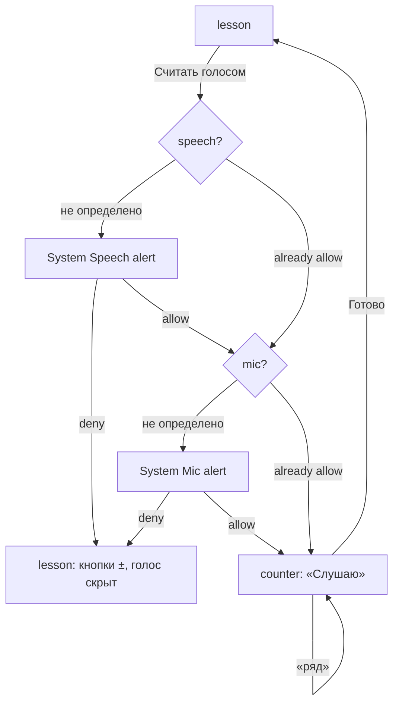
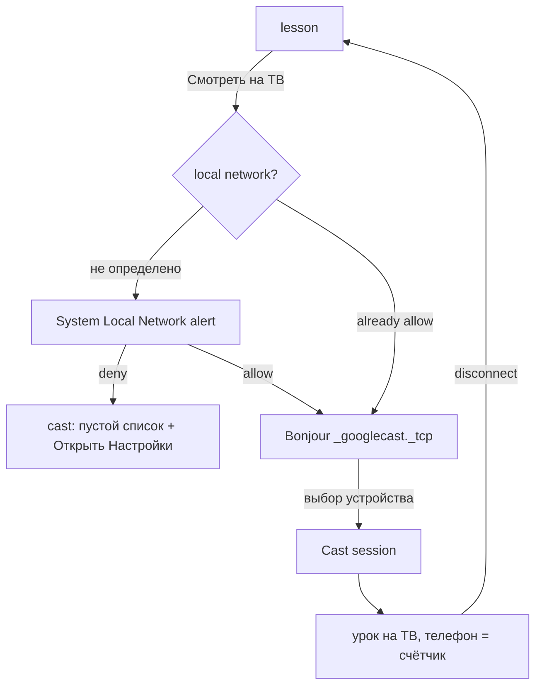
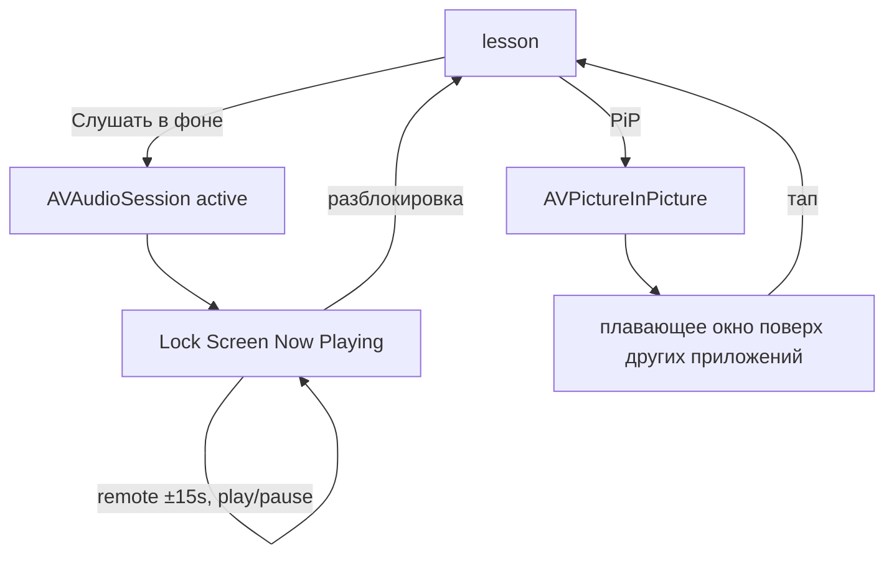
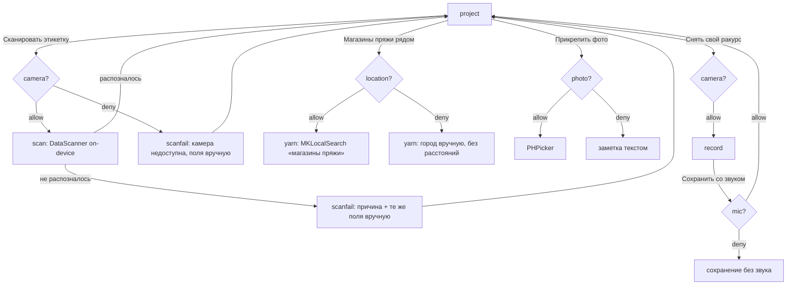

# Петля — карта экранов и архитектура

Документ согласован с [01-product-vision.md](./01-product-vision.md). Приложение клиентское: своего бэкенда нет. Все доступы — just-in-time; Background Modes только `audio`; Вход по номеру — на SDK провайдера.

---

## Информационная архитектура (IA)

### Tab bar

Холодный старт открывает **вход по номеру**: `phone` → `code` → `lessons`. Таб-бара на этих экранах нет.

| Tab | Root screen ID | Роль |
|---|---|---|
| Уроки | `lessons` | Каталог курса, вход в урок |
| Проекты | `projects` | Дневник: прогресс, материалы, заметки, свои записи |
| Профиль | `settings` | Уведомления, приватность, воспроизведение |

### Стек навигации

Дерево ниже выведено из разметки экранов и `concept.json`, руками не правится: вложенность — по `parent`, подпись «открывается» — реальный элемент прототипа.

<!-- @generated:ia-tree -->
```
Регистрация по почте (phone) — старт, без таб-бара · открывается: старт

Уроки (lessons) — tab (root, старт) · открывается: «Создать аккаунт», «Продолжить» (tracking)
    └─ Урок (lesson) — fullscreen · открывается: «Продолжить · урок 4», «9 ур.» …, «Гостиная», «Смотреть на ТВ» · speech, localnet, audio
        ├─ Счётчик рядов (counter) — sheet · открывается: «Считать голосом» (speech)
        ├─ Устройства (cast) — sheet · открывается: «Смотреть на ТВ» (localnet), «Телевизор»
        ├─ Picture in Picture (pip) — system · открывается: «Picture in Picture»
        └─ Фон / блокировка (background) — system · открывается: «Слушать в фоне» (audio), «Звук в фоне»

Проекты (projects) — tab (root) · открывается: вкладка таб-бара
    └─ Проект (project) — push · открывается: «Ажурный шарф», «Носки на пяти» …, «Сохранить со звуком» (mic), «Добавить в проект» · camera, photo, location
        ├─ Свой ракурс (record) — fullscreen · открывается: «Снять», «Снять свой ракурс» (camera) · mic
        ├─ Этикетка (scan) — fullscreen · открывается: «Сканировать этикетку»
        │   └─ Ввод вручную (scanfail) — modal (ошибка) · открывается: «Не распознаётся — ввести вручную»
        ├─ Галерея (gallery) — system picker · открывается: «Прикрепить фото прогресса» (photo)
        └─ Магазины пряжи (yarn) — modal · открывается: «Магазины пряжи рядом» (location)

Профиль (settings) — tab (root) · открывается: вкладка таб-бара · push
    └─ Реклама (ads) — modal · открывается: «Отслеживание» · tracking
```
<!-- @end -->

### Модалки и sheets

| Экран | Представление | Откуда |
|---|---|---|
| `counter` | sheet поверх `lesson` | урок |
| `cast` | sheet | урок, профиль |
| `record`, `scan` | fullscreen поверх `project` | проект, каталог проектов |
| `scanfail` | modal | скан не распознал этикетку; отказ в камере с экрана проекта |
| `gallery` | system PHPicker | проект |
| `yarn` | modal | проект |
| `ads` | modal (объяснение + ATT) | профиль |

### Системные поверхности (не кастомный UI)

| ID | Тип | Триггер |
|---|---|---|
| `pip` | `AVPictureInPictureController` | урок → PiP или уход из приложения |
| `background` | Lock Screen / Control Center Now Playing | урок → «Слушать в фоне», блокировка экрана |
| `gallery` | `PHPickerViewController` | проект → «Прикрепить фото» |
| Permission alerts | UIKit / system | первый запрос capability |
| SMS-код | `ASWebAuthenticationSession` / SDK провайдера, автоподстановка из уведомления | вход по номеру |
| ATT | AppTrackingTransparency | `ads` → «Продолжить» |

### Правила IA

1. Первые экраны — всегда **вход по номеру** (`phone` → `code`), **без** permission-алертов. Доступы начинаются после входа.
2. Один capability = один явный жест пользователя. Исключение — entitlement `audio`: активируется сценарием и системного alert не показывает.
3. Отказ → рабочий fallback, а не заглушка. Повторный системный alert **не** показываем, только «Открыть Настройки». Fallback-состояние ещё и **убирает** то, чего без доступа быть не может: без геопозиции нет расстояний, без локальной сети нет списка устройств, без речи нет индикатора «Слушаю».
4. `speech` и `mic` для голосового счётчика запрашиваются цепочкой: два системных алерта подряд. Отказ на любом шаге уводит на fallback и второй ключ уже не спрашивается.
5. Сбой фичи ≠ отказ доступа. Скан не распознал этикетку → `scanfail`. У каждого — причина, один основной путь и один запасной.
6. Успех подтверждается тостом, а не экраном. `data-toast="Текст|экран"`: полоска на 2,6 с и переход туда, где результат виден.
7. Родитель каждого экрана объявлен в `concept.json` (`parent`) — по нему считается возврат. Экраны с несколькими входами возвращаются к тому, откуда их реально открыли.

---

## Карта экранов

<!-- @generated:screen-map -->
| ID | Название | Тип | Доступы |
|---|---|---|---|
| `phone` | Регистрация по почте | старт, без таб-бара | — |
| `lessons` | Уроки | tab (root, старт) | — |
| `lesson` | Урок | fullscreen | speech, localnet, audio (activate) |
| `counter` | Счётчик рядов | sheet | — |
| `cast` | Устройства | sheet | — |
| `pip` | Picture in Picture | system | — |
| `background` | Фон / блокировка | system | — |
| `projects` | Проекты | tab (root) | — |
| `project` | Проект | push | camera, photo, location |
| `record` | Свой ракурс | fullscreen | mic |
| `scan` | Этикетка | fullscreen | — |
| `scanfail` | Ввод вручную | modal (ошибка) | — |
| `gallery` | Галерея | system picker | — |
| `yarn` | Магазины пряжи | modal | — |
| `ads` | Реклама | modal | tracking |
| `settings` | Профиль | tab (root) | push |
<!-- @end -->

### Переходы: откуда куда и чем

Каждая строка — элемент, который есть в прототипе. Вкладки таб-бара опущены: они ведут в корни разделов и на каждом экране одни и те же.

<!-- @generated:transitions -->
| Экран | Что можно сделать | Ведёт на | Доступ | Тип перехода |
|---|---|---|---|---|
| `phone` | «Создать аккаунт» | `lessons` | — | переход |
| `lessons` | «Продолжить · урок 4», «9 ур.» … | `lesson` | — | переход |
| `lesson` | «Назад к урокам» | `lessons` | — | возврат по IA |
| `lesson` | «Picture in Picture» | `pip` | — | переход |
| `lesson` | «Смотреть на ТВ» | `cast` | `NSLocalNetworkUsageDescription` | доступ разрешён |
| `lesson` | «Смотреть на ТВ» | `lesson` | `NSLocalNetworkUsageDescription` | отказ → fallback |
| `lesson` | «Слушать в фоне» | `background` | `UIBackgroundModes: audio` | entitlement, без alert |
| `lesson` | «Считать голосом» | `counter` | `NSSpeechRecognitionUsageDescription` | доступ разрешён |
| `lesson` | «Считать голосом» | `lesson` | `NSSpeechRecognitionUsageDescription` | отказ → fallback |
| `counter` | «Закрыть счётчик» | `lesson` | — | возврат по IA |
| `cast` | «Закрыть» | `lesson` | — | возврат по IA |
| `cast` | «Гостиная», «Смотреть на ТВ» | `lesson` | — | переход |
| `pip` | «Раппорт ажура» | `lesson` | — | возврат по IA |
| `background` | «Петля» | `lesson` | — | возврат по IA |
| `projects` | «Снять» | `record` | — | переход |
| `projects` | «Ажурный шарф», «Носки на пяти» … | `project` | — | переход |
| `project` | «Назад к проектам» | `projects` | — | возврат по IA |
| `project` | «Сканировать этикетку» | `scan` | — | переход |
| `project` | «Магазины пряжи рядом» | `yarn` | `NSLocationWhenInUseUsageDescription` | доступ разрешён |
| `project` | «Прикрепить фото прогресса» | `gallery` | `NSPhotoLibraryUsageDescription` | доступ разрешён |
| `project` | «Прикрепить фото прогресса» | `project` | `NSPhotoLibraryUsageDescription` | отказ → fallback |
| `project` | «Снять свой ракурс» | `record` | `NSCameraUsageDescription` | доступ разрешён |
| `project` | «Снять свой ракурс» | `project` | `NSCameraUsageDescription` | отказ → fallback |
| `record` | «Закрыть» | `project` | — | возврат по IA |
| `record` | «Сохранить со звуком» | `project` | `NSMicrophoneUsageDescription` | доступ разрешён |
| `record` | «Сохранить со звуком» | `record` | `NSMicrophoneUsageDescription` | отказ → fallback |
| `scan` | «Закрыть» | `project` | — | возврат по IA |
| `scan` | «Не распознаётся — ввести вручную» | `scanfail` | — | переход |
| `scanfail` | «Добавить в проект» | `project` | — | переход |
| `gallery` | — | — | — | дальше переходов нет |
| `yarn` | — | — | — | дальше переходов нет |
| `ads` | «Продолжить» | `lessons` | `NSUserTrackingUsageDescription` | доступ разрешён |
| `ads` | «Продолжить» | `ads` | `NSUserTrackingUsageDescription` | отказ → fallback |
| `settings` | «Новые уроки» | `settings` | `aps-environment` | доступ разрешён |
| `settings` | «Отслеживание» | `ads` | — | переход |
| `settings` | «Телевизор» | `cast` | — | переход |
| `settings` | «Звук в фоне» | `background` | — | переход |
<!-- @end -->

## Действия на экранах

Каждый интерактивный элемент прототипа: что он делает, куда ведёт и какой ключ при этом запрашивается. В отличие от таблицы переходов выше, вкладки таб-бара, кнопки возврата и подтверждения без перехода тоже здесь — раздел выводится из разметки и отвечает на вопрос «что делает эта кнопка», не заставляя открывать HTML.

<!-- @generated:actions -->
| Экран | Элемент | Роль | Что делает | Ведёт на | При отказе | Ключ |
|---|---|---|---|---|---|---|
| `phone` | Создать аккаунт | элемент экрана | открывает экран | Уроки (lessons) | — | — |
| `phone` | Помощь | элемент экрана | показывает подтверждение «Помощь · petlya.app/help» | остаётся на экране | — | — |
| `phone` | Поддержка | элемент экрана | показывает подтверждение «Поддержка · alex@inbox.ru» | остаётся на экране | — | — |
| `phone` | Пользовательское соглашение | элемент экрана | показывает подтверждение «Соглашение · petlya.app/terms» | остаётся на экране | — | — |
| `lessons` | Продолжить · урок 4 | элемент экрана | открывает экран | Урок (lesson) | — | — |
| `lessons` | 9 ур. | элемент экрана | открывает экран | Урок (lesson) | — | — |
| `lessons` | 6 ур. | элемент экрана | открывает экран | Урок (lesson) | — | — |
| `lessons` | 9 ур. | элемент экрана | открывает экран | Урок (lesson) | — | — |
| `lessons` | Раздел Уроки | вкладка | переключает вкладку таб-бара | Уроки (lessons) | — | — |
| `lessons` | Раздел Проекты | вкладка | переключает вкладку таб-бара | Проекты (projects) | — | — |
| `lessons` | Раздел Профиль | вкладка | переключает вкладку таб-бара | Профиль (settings) | — | — |
| `lesson` | Назад к урокам | кнопка «назад» | возвращает к родительскому экрану | Уроки (lessons) | — | — |
| `lesson` | Picture in Picture | элемент экрана | открывает экран | Picture in Picture (pip) | — | — |
| `lesson` | Смотреть на ТВ | элемент экрана | спрашивает доступ localnet | Устройства (cast) | Урок (lesson) | `NSLocalNetworkUsageDescription` |
| `lesson` | Слушать в фоне | элемент экрана | включает entitlement audio, системного alert нет | Фон / блокировка (background) | — | `UIBackgroundModes: audio` |
| `lesson` | Считать голосом | элемент экрана | спрашивает доступ speech | Счётчик рядов (counter) | Урок (lesson) | `NSSpeechRecognitionUsageDescription` |
| `counter` | Закрыть счётчик | кнопка «назад» | возвращает к родительскому экрану | Урок (lesson) | — | — |
| `cast` | Закрыть | кнопка «назад» | возвращает к родительскому экрану | Урок (lesson) | — | — |
| `cast` | Гостиная | элемент экрана | открывает экран | Урок (lesson) | — | — |
| `cast` | Смотреть на ТВ | элемент экрана | открывает экран | Урок (lesson) | — | — |
| `pip` | Раппорт ажура | кнопка «назад» | возвращает к родительскому экрану | Урок (lesson) | — | — |
| `background` | Петля | кнопка «назад» | возвращает к родительскому экрану | Урок (lesson) | — | — |
| `projects` | Снять | элемент экрана | открывает экран | Свой ракурс (record) | — | — |
| `projects` | Ажурный шарф | элемент экрана | открывает экран | Проект (project) | — | — |
| `projects` | Носки на пяти | элемент экрана | открывает экран | Проект (project) | — | — |
| `projects` | Косы и араны | элемент экрана | открывает экран | Проект (project) | — | — |
| `projects` | Раздел Уроки | вкладка | переключает вкладку таб-бара | Уроки (lessons) | — | — |
| `projects` | Раздел Проекты | вкладка | переключает вкладку таб-бара | Проекты (projects) | — | — |
| `projects` | Раздел Профиль | вкладка | переключает вкладку таб-бара | Профиль (settings) | — | — |
| `project` | Назад к проектам | кнопка «назад» | возвращает к родительскому экрану | Проекты (projects) | — | — |
| `project` | Сканировать этикетку | элемент экрана | открывает экран | Этикетка (scan) | — | — |
| `project` | Магазины пряжи рядом | элемент экрана | спрашивает доступ location | Магазины пряжи (yarn) | Магазины пряжи (yarn) | `NSLocationWhenInUseUsageDescription` |
| `project` | Прикрепить фото прогресса | элемент экрана | спрашивает доступ photo | Галерея (gallery) | Проект (project) | `NSPhotoLibraryUsageDescription` |
| `project` | Снять свой ракурс | элемент экрана | спрашивает доступ camera | Свой ракурс (record) | Проект (project) | `NSCameraUsageDescription` |
| `record` | Закрыть | кнопка «назад» | возвращает к родительскому экрану | Проект (project) | — | — |
| `record` | Сохранить со звуком | элемент экрана | спрашивает доступ mic | Проект (project) | Свой ракурс (record) | `NSMicrophoneUsageDescription` |
| `scan` | Закрыть | кнопка «назад» | возвращает к родительскому экрану | Проект (project) | — | — |
| `scan` | Не распознаётся — ввести вручную | элемент экрана | открывает экран | Ввод вручную (scanfail) | — | — |
| `scanfail` | Добавить в проект | элемент экрана | открывает экран | Проект (project) | — | — |
| `gallery` | — | — | интерактивных элементов нет | — | — | — |
| `yarn` | — | — | интерактивных элементов нет | — | — | — |
| `ads` | Продолжить | элемент экрана | спрашивает доступ tracking | Уроки (lessons) | Реклама (ads) | `NSUserTrackingUsageDescription` |
| `settings` | Новые уроки | элемент экрана | спрашивает доступ push | Профиль (settings) | Профиль (settings) | `aps-environment` |
| `settings` | Отслеживание | элемент экрана | открывает экран | Реклама (ads) | — | — |
| `settings` | Телевизор | элемент экрана | открывает экран | Устройства (cast) | — | — |
| `settings` | Звук в фоне | элемент экрана | открывает экран | Фон / блокировка (background) | — | — |
| `settings` | Раздел Уроки | вкладка | переключает вкладку таб-бара | Уроки (lessons) | — | — |
| `settings` | Раздел Проекты | вкладка | переключает вкладку таб-бара | Проекты (projects) | — | — |
| `settings` | Раздел Профиль | вкладка | переключает вкладку таб-бара | Профиль (settings) | — | — |
<!-- @end -->

---

## Матрица запросов доступов

<!-- @generated:perm-matrix -->
| Ключ | Жест пользователя | Экран | Если отказ | Риск Review |
|---|---|---|---|---|
| `NSSpeechRecognitionUsageDescription` | «Считать голосом» | Урок | Счёт кнопками ±, голосовая кнопка скрывается | Низкий |
| `NSMicrophoneUsageDescription` | «Считать голосом» / «Сохранить со звуком» | Свой ракурс | Кнопки ± / запись сохраняется без звука | Низкий |
| `NSLocalNetworkUsageDescription` | «Смотреть на ТВ» | Урок | Пустой список устройств + «Открыть Настройки» | Низкий |
| `UIBackgroundModes: audio` | «Слушать в фоне» / PiP | Урок | Без entitlement звук обрывается — не ship | **Условный** — Реальный playback, заполненный MPNowPlayingInfoCenter и remote-команды |
| `NSCameraUsageDescription` | «Снять свой ракурс» / «Сканировать этикетку» | Проект | Пустое состояние + «Открыть Настройки»; данные мотка вводятся вручную | Низкий |
| `NSPhotoLibraryUsageDescription` | «Прикрепить фото прогресса» | Проект | Заметка сохраняется текстом | Низкий |
| `NSLocationWhenInUseUsageDescription` | «Магазины пряжи рядом» | Проект | Ручной ввод города, поиск без геопривязки | **Условный** — Экран должен реально искать через MKLocalSearch |
| `aps-environment` | Свитч «Новые уроки» | Профиль | Фича выключена в UI | **Условный** — Настоящая регистрация в APNs и хотя бы один живой пуш |
| `NSUserTrackingUsageDescription` | «Продолжить» в блоке о рекламе | Реклама | Неперсонализированная реклама | **Условный** — Ad SDK реально в сборке и IDFA действительно уходит в SDK |
<!-- @end -->

### Три условных доступа

`location`, `push` и `tracking` держатся не на формулировке, а на реализации. Если экран «Магазины пряжи» не ищет через `MKLocalSearch`, регистрации в APNs нет, а рекламы в сборке нет — это те три места, за которые потянут. Либо фича делается, либо ключ убирается.

Отдельно про `location`: ищем **категорию магазинов**, а не конкретный артикул пряжи. Приложение не знает чужой ассортимент и ничего не обещает про наличие — обещание, которое нельзя выполнить, разбирается в Review быстрее, чем формулировка строки.

**Правило, которое важнее матрицы:** до каждой фичи ревьюер должен дойти сам за 2–3 тапа без инструкции. Фича, которая в сборке есть, но спрятана, по последствиям равна её отсутствию.

### Privacy strings

| Ключ | Смысл строки (RU → EN для стора) |
|---|---|
| Speech Recognition | Счёт рядов по голосовой команде / Counting rows by voice command |
| Microphone | Приём голосовых команд и звук в ваших записях / Voice commands and audio in your recordings |
| Camera | Съёмка своих приёмов и сканирование этикетки мотка / Recording your technique and scanning yarn labels |
| Photo Library | Фото прогресса в заметках к проекту / Progress photos in project notes |
| Location When In Use | Поиск магазинов пряжи рядом / Finding yarn shops nearby |
| Local Network | Поиск телевизора и Chromecast / Finding a TV or Chromecast |
| User Tracking | Реклама по интересам между уроками / Interest-based ads between lessons |

---

## User flows

### Голосовой счётчик — цепочка из двух алертов



### Урок на телевизоре



### Непрерывность воспроизведения



*Оба пути активируют один entitlement `audio` — системного alert нет.*


### Проект: материалы и заметки



---

## Архитектура клиента

### Слои

| Слой | Содержимое |
|---|---|
| **UI** | Экраны, tab bar, nav stack, system ask, snackbar. Статусы доступов не хранит — только отображает |
| **Domain** | `Course` · `Lesson` · `Chart` · `RowCounter` · `Project` · `Note` · `YarnLot` · `PlaybackSession` · `CastSession` · `AdConsent` |
| **Services** | `Permissions` · `Playback` (AVPlayer, PiP, BG audio, Now Playing) · `Cast` (Bonjour / Chromecast) · `SpeechCounter` (SFSpeechRecognizer, on-device) · `Capture` · `LabelScanner` (DataScanner) · `MediaPicker` (PHPicker) · `YarnShops` (MKLocalSearch) · `Push` (SDK) · `PhoneAuth` (SDK провайдера) · `AdsAttribution` (ATT) |
| **Data** | CoreData — проекты, заметки, счётчик рядов. Keychain — токен входа. FileManager — свои записи. Контент-пак — только чтение |
| **External** | CDN контент-пака · APNs через SDK провайдера · SDK входа по номеру · Cast SDK · Ad SDK · MapKit · страницы-источники — только чтение разметки |

`PermissionsService` — единственная точка запроса доступов. Экраны спрашивают у него статус и подписываются на изменения; сами `AVCaptureDevice.requestAccess` и подобные вызовы из UI не делаются.

### Контент-пак

Каталог и видео — статика. Формат минимальный:

```json
{
  "version": 3,
  "courses": [{
    "id": "azhurnyy-sharf",
    "title": "Ажурный шарф",
    "lessons": [{
      "id": "azhur-rapport",
      "title": "Раппорт ажура по схеме",
      "duration": 740,
      "video": "https://cdn.petlya.app/v/azhur-rapport.mp4",
      "chart": "https://cdn.petlya.app/c/azhur-rapport.svg",
      "rows": 96
    }]
  }]
}
```

Клиент кэширует пак и скачанные уроки локально. Запись на сервер не идёт никогда — ни аналитики прогресса, ни синхронизации проектов.

### Что нужно на хостинге

1. `lessons.json` + mp4 + схемы на CDN.
3. Дашборд push-провайдера — для ручной отправки «вышел новый урок».

Ничего из этого не требует написания серверного кода.

---

## Заметки для Review

1. **Background audio** — в Review notes описать сценарий: пользователь вяжет, экран гаснет, голос урока продолжает вести. Приложить видео с локскрином и Now Playing.
2. **Local Network** — указать, что ищется `_googlecast._tcp` для показа урока на телевизоре, и приложить демо с реальным устройством.
3. **Speech Recognition** — подчеркнуть, что распознавание идёт на устройстве (`requiresOnDeviceRecognition = true`), словарь ограничен командами счётчика, аудио никуда не отправляется.
4. **ATT** — показывать только после экрана с объяснением, никогда на старте.
6. **Location** — ищется категория «магазины пряжи» через `MKLocalSearch`, наличие товара не обещаем. Без доступа экран честно переключается на ручной ввод города и убирает расстояния.
7. **Демо-доступ** — вход по номеру: приложить тестовый номер и код в Review notes, иначе ревьюер упрётся в первый экран.
8. **Проверить перед сдачей:** каждый заявленный ключ имеет экран, до которого 2–3 тапа; ни один ключ не заявлен «про запас»; `webcredentials` в entitlements отсутствует.

## Граница «без бэкенда»

<!-- @generated:backendless -->
| Требовало бы сервера | Решение без сервера |
|---|---|
| Каталог уроков и видео | Контент-пак: `lessons.json` + mp4 статикой на CDN. Только чтение |
| Регистрация по почте и сессия | SDK провайдера аутентификации по почте, токен в Keychain общей группы |
| Профили, подписки, лайки | Вырезаны. Вход только опознаёт устройство — ни ленты, ни UGC, ни модерации |
| Комментарии | Заметки к таймкоду, локально в CoreData |
| Прямые эфиры | Вырезаны. Вместо них — локальная запись своего ракурса |
| Push через APNs | SDK провайдера (OneSignal / FCM), отправка из дашборда школы |
| Публикация в облако | Экспорт файла через системный share sheet |
| Магазины пряжи | `MKLocalSearch` с запросом «магазины пряжи» — карты Apple, категория, а не товар |
| Распознавание речи и этикетки | `SFSpeechRecognizer` on-device + `DataScannerViewController`; не распозналось — форма ручного ввода |
| Реклама | Ad SDK с медиацией |
<!-- @end -->
